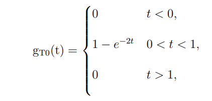
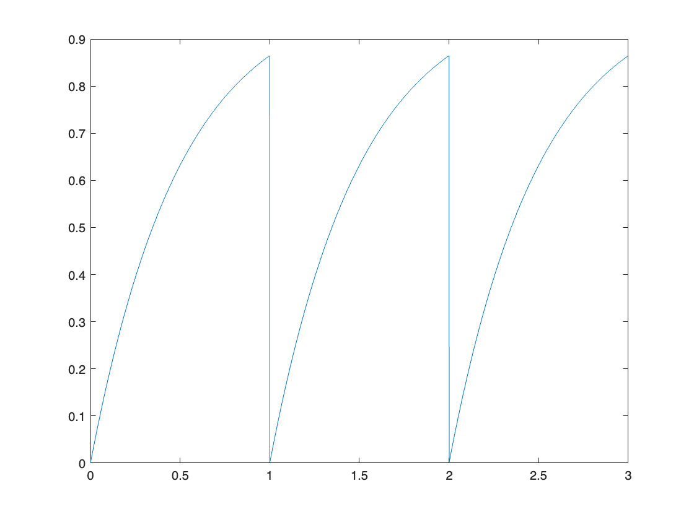
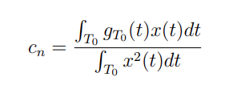
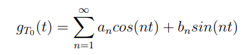
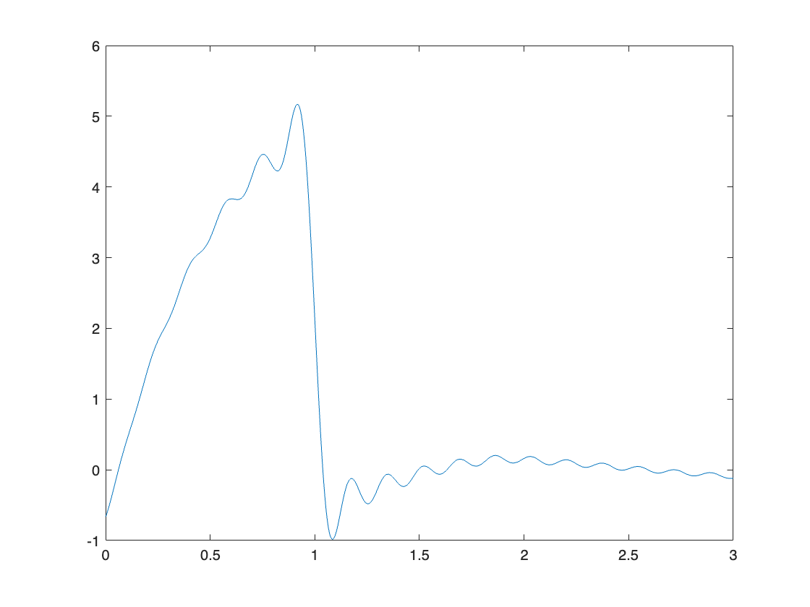
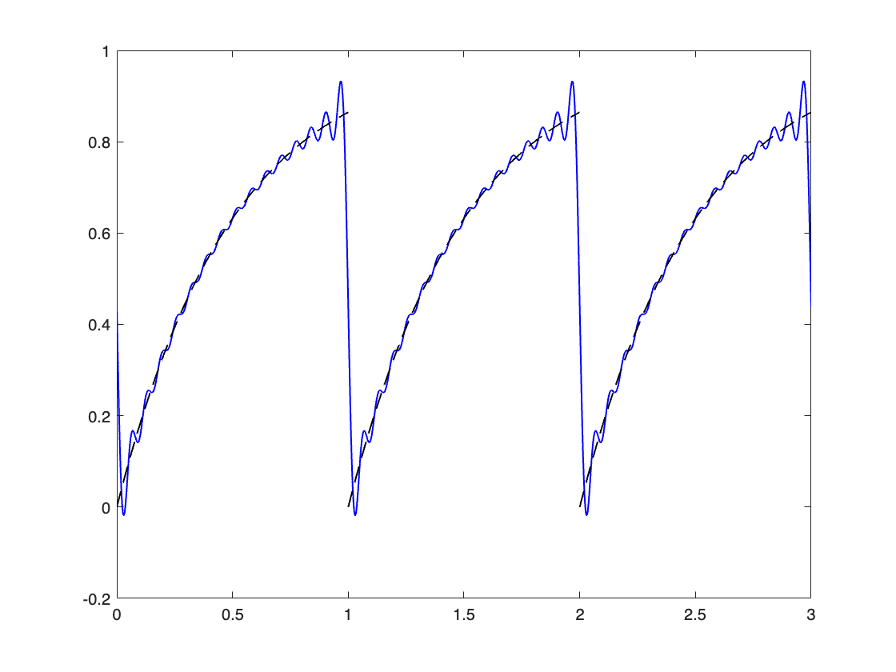
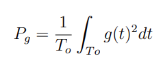

# Aula\_02\_ECM307 \- Analogia entre vetores e sinais

Felipe Fazio da Costa; RA: 23.00055\-4

<a name="beginToc"></a>

## Conteúdo
&emsp;[Boas práticas](#boas-práticas)
 
&emsp;[Sinal equação 3](#sinal-equação-3)
 
&emsp;[Calculando an:](#calculando-an-)
 
&emsp;[Calculando bn:](#calculando-bn-)
 
&emsp;[Substituindo os valores an:](#substituindo-os-valores-an-)
 
&emsp;[substituindo valores bn:](#substituindo-valores-bn-)
 
&emsp;[Concatenando os valores de an e bn](#concatenando-os-valores-de-an-e-bn)
 
&emsp;[Correção sobre a curva prévia](#correção-sobre-a-curva-prévia)
 
&emsp;[Calculando an(2.0):](#calculando-an-2-0-)
 
&emsp;[Calculando bn(2.0):](#calculando-bn-2-0-)
 
&emsp;[Parte Numérica:](#parte-numérica-)
 
&emsp;[Potência do sinal:](#potência-do-sinal-)
 
&emsp;[Conclusão](#conclusão)
 
<a name="endToc"></a>

# Boas práticas
```matlab
%%% Limpando todo sistema para início dos calculos
clear;
close all;
clc;
```

# Sinal equação 3



```matlab
syms t  %%% Inicialização das variáveis a serem utilizadas.

%%% Numericamente o primeiro período:
t = 0 : 1e-3 : 1;
g = 1 - exp(-2*t);

%%% Numericamente 3 períodos:
t = 0 : 1e-3 : 3;
plot(t, [g g(2:end) g(2:end)]);
```



# Calculando an:



```matlab
syms n t %%% Inicialização de variáveis.

%%% Cálculo do numerador da integral de an:
num_an = int((1 - exp(-2*t)) * cos(n * t), t, 0, 1)
```
num_an = 
 $\displaystyle \frac{\sin \left(n\right)}{n}-\frac{{\mathrm{e}}^{-2} \,{\left(2\,{\mathrm{e}}^2 -2\,\cos \left(n\right)\right)}+n\,{\mathrm{e}}^{-2} \,\sin \left(n\right)}{n^2 +4}$
 

```matlab
%%% Cálculo do denominador da integral de an:
den_an = int(cos(n * t)^2, t, 0, 1)
```
den_an = 
 $\displaystyle \frac{\sin \left(2\,n\right)}{4\,n}+\frac{1}{2}$
 

# Calculando bn:
```matlab
syms n t %%% Inicialização de variáveis.

%%% Cálculo do numerador da integral de bn:
num_bn = int((1 - exp(-2*t)) * sin(n * t), t, 0, 1)
```
num_bn = 
 $\displaystyle \frac{2\,{\mathrm{e}}^{-2} \,\sin \left(n\right)-n\,{\mathrm{e}}^{-2} \,{\left({\mathrm{e}}^2 -\cos \left(n\right)\right)}}{n^2 +4}-\frac{\cos \left(n\right)-1}{n}$
 

```matlab

%%% Cálculo do denominador da integral de bn:
den_bn = int(sin(n * t)^2, t, 0, 1)
```
den_bn = 
 $\displaystyle \frac{1}{2}-\frac{\sin \left(2\,n\right)}{4\,n}$
 

# Substituindo os valores an:
```matlab
%%% definição de n para parte numérica:
N  = 36;
n  = 1:1:N;

Num_numerico_an = eval(num_an);
Den_numerico_an = eval(den_an);

%%% Resultado numérico:
an = Num_numerico_an./Den_numerico_an
```

```matlabTextOutput
an = 1x36
    0.6159    0.3942   -0.2765   -0.4940   -0.4986   -0.1767    0.0901    0.1587    0.0281   -0.1315   -0.1901   -0.1056    0.0348    0.1021    0.0578   -0.0477   -0.1104   -0.0858    0.0041    0.0684    0.0607   -0.0100   -0.0704   -0.0730   -0.0147    0.0446    0.0562    0.0111   -0.0441   -0.0616   -0.0265    0.0260    0.0488    0.0234   -0.0245   -0.0506

```

# substituindo valores bn:
```matlab
%%% definição de n para parte numérica:
N  = 36;
n  = 1:1:N;

Num_numerico_bn = eval(num_bn);
Den_numerico_bn = eval(den_bn);

%%% Resultado numérico:
bn = Num_numerico_bn./Den_numerico_bn
```

```matlabTextOutput
bn = 1x36
1.1731    0.7984    0.7732    0.4233   -0.0597   -0.2408   -0.1724    0.0534    0.1819    0.1581    0.0008   -0.1152   -0.1198   -0.0115    0.0888    0.1069    0.0283   -0.0617   -0.0895   -0.0338    0.0460    0.0795    0.0407   -0.0304   -0.0679   -0.0428    0.0196    0.0595    0.0453   -0.0091   -0.0504   -0.0452    0.0014    0.0431    0.0452    0.0059

```

# Concatenando os valores de an e bn



```matlab
g_aprox = 0;

tempo = [0 : 1e-3 : 3];

for k = 1:N

    g_aprox  =  g_aprox + an(k)*cos(n(k)*tempo) + + bn(k)*sin(n(k)*tempo);

end

plot(tempo,g_aprox)
```



# Correção sobre a curva prévia
```matlab
%%% Limpar variáveis:

clear;
close all;
clc;

%%% Inicializações de variáveis:
syms t n;
w = 2 * pi;
```

# Calculando an(2.0):
```matlab
num_an = int((1-exp(-2*t))*cos(n*w*t),t,0,1);                         
den_an = int((cos(n*w*t))^2,t,0,1);                    

num_numerico_an = eval(num_an);                           
den_numerico_an = eval(den_an);                           

an = num_numerico_an ./ den_numerico_an
```
an = 
 $\displaystyle -\frac{\frac{\frac{1218991862308979\,\pi \,n\,\sin \left(2\,\pi \,n\right)}{18014398509481984}-\frac{1218991862308979\,\cos \left(2\,\pi \,n\right)}{18014398509481984}+\frac{5070602400912918119859106409109}{10141204801825835211973625643008}}{\frac{2778046668940015\,n^2 }{281474976710656}+1}-\frac{\sin \left(2\,\pi \,n\right)}{2\,n\,\pi }}{\frac{\sin \left(4\,\pi \,n\right)}{8\,n\,\pi }+\frac{1}{2}}$
 

# Calculando bn(2.0):
```matlab
num_bn = int((1-exp(-2*t))*sin(n*w*t),t,0,1);           
den_bn = int((sin(n*w*t))^2,t,0,1);                     

num_numerico_bn = eval(num_bn);                                       
den_numerico_bn = eval(den_bn);                           

bn = num_numerico_bn ./ den_numerico_bn
```
bn = 
 $\displaystyle -\frac{\frac{\frac{1218991862308979\,\cos \left(\pi \,n\right)\,\sin \left(\pi \,n\right)}{9007199254740992}+\frac{1218991862308979\,n\,{\left(\pi \,{\left(2\,{\cos \left(\pi \,n\right)}^2 -1\right)}-\frac{1633498112715975}{70368744177664}\right)}}{18014398509481984}}{\frac{2778046668940015\,n^2 }{281474976710656}+1}+\frac{{\sin \left(\pi \,n\right)}^2 }{n\,\pi }}{\frac{\sin \left(4\,\pi \,n\right)}{8\,n\,\pi }-\frac{1}{2}}$
 

# Parte Numérica:
```matlab
% Declarando variáveis para o plot
g(t)=1-exp(-2*t);

% cálculo de a0 para o ajuste de amplitude do sinal sintetizado, e iniciando a soma com ele
aux = (int(g(t),t,0,1))/1;                   
tempo = 0:1e-3:3;
t1 = 0:1e-3:1;                                    
t2 = 1:1e-3:2;                                    
t3 = 2:1e-3:3;                                    

% Declarando o número de Harmônicas:
N = 15;
n = 1:1:N;

% Preparando an e bn para o plot considerando o número de harmônicas definido
num_numerico_an_plot = eval(num_an);                                            
den_numerico_an_plot = eval(den_an);                                            

an_plot = num_numerico_an_plot ./ den_numerico_an_plot;                         

num_numerico_bn_plot = eval(num_bn);                                            
den_numerico_bn_plot = eval(den_bn);                                            

bn_plot = num_numerico_bn_plot ./ den_numerico_bn_plot;                       

% Obtenção do sinal sintetizado
for k = 1:N

    aux  =  aux + an_plot(k)*cos(n(k)*w*tempo) + bn_plot(k)*sin(n(k)*w*tempo);

end

gt0_sintetizado = aux;                              

g1 = 1-exp(-2*(t1));                                                   
g2 = 1-exp(-2*(t2-1));                                                 
g3 = 1-exp(-2*(t3-2));

% Fazendo os plots
plot(tempo,gt0_sintetizado,'LineWidth',1,'Color',"b");hold
```

```matlabTextOutput
Current plot held
```

```matlab
plot(t1,g1,'LineWidth',1,'Color',"k","LineStyle","--");               
plot(t2,g2,'LineWidth',1,'Color',"k","LineStyle","--");               
plot(t3,g3,'LineWidth',1,'Color',"k","LineStyle","--"); 
```



# Potência do sinal:



```matlab
% cálculo da potência em watts
P = 1/1 * int(((1-exp(-2*t))^2),t,0,1) 
```
P = 
 $\displaystyle {\mathrm{e}}^{-2} -\frac{{\mathrm{e}}^{-4} }{4}+\frac{1}{4}$
 

# Conclusão

Inicialmente, observa\-se que o sinal sintetizado difere do sinal original em amplitude e frequência. Essas discrepâncias são causadas por dois problemas no modelo matemático, que, uma vez corrigidos, permitem que o sinal sintetizado se aproxime significativamente do original.

1.  **Ajuste da frequência fundamental**:O sinal original possui período *T*=1 segundo, o que implica em uma frequência *f*=1 Hz. No entanto, a frequência fundamental das funções trigonométricas não foi corretamente ajustada nas equações (2) e (3), resultando em um número incorreto de ciclos no intervalo de 1 a 3 segundos. Ao corrigir a frequência fundamental para *ω*=2*π rad/s*, o número de ciclos é ajustado, alinhando o sinal sintetizado ao original.
2. **Correção da amplitude**:A amplitude do sinal sintetizado também apresentou diferenças em relação ao sinal original. Isso ocorre porque o valor médio do sinal original não é zero, enquanto a soma de senos e cossenos tem valor médio nulo. Para resolver isso, calculou\-se o valor médio do sinal original usando a fórmula $a_0 =\frac{1}{T_0 }{\int_{T_0 } g_{T_0 } (t)dt}$ . Ao adicionar a0 à somatória das componentes harmônicas, a amplitude do sinal sintetizado foi corrigida, resultando em uma aproximação mais fiel ao sinal original.

Com essas correções, o sinal sintetizado passou a apresentar características de amplitude e frequência consistentes com o sinal original, demonstrando a importância de ajustes precisos no modelo matemático para uma representação adequada de sinais periódicos.

