# Aula\_04\_ECM307 \- Série Trigonométrica de Fourier

Felipe Fazio da Costa; RA: 23.00055\-4

<a name="beginToc"></a>

## Conteúdo
&emsp;[Boas práticas](#boas-práticas)
 
&emsp;[Função para análise(gT0(t)):](#função-para-análise-gt0-t-)
 
&emsp;[Determinando potência](#determinando-potência)
 
&emsp;[Análise por Fourier](#análise-por-fourier)
 
&emsp;[Espéctro de amplitude de Dn:](#espéctro-de-amplitude-de-dn-)
 
&emsp;[Numérico de Dn](#numérico-de-dn)
 
&emsp;[Síntese do sinal](#síntese-do-sinal)
 
&emsp;[Função para análise(fT0(t)):](#função-para-análise-ft0-t-)
 
&emsp;[Determinando potência](#determinando-potência)
 
&emsp;[Análise por Fourier](#análise-por-fourier)
 
&emsp;[Espéctro de amplitude de Dn:](#espéctro-de-amplitude-de-dn-)
 
&emsp;[Numérico de Dn](#numérico-de-dn)
 
&emsp;[Síntese do sinal](#síntese-do-sinal)
 
&emsp;[Função para análise(fT0(t)+gT0(t)):](#função-para-análise-ft0-t-gt0-t-)
 
&emsp;[Determinando potência](#determinando-potência)
 
&emsp;[Análise por Fourier](#análise-por-fourier)
 
&emsp;[Espéctro de amplitude de Dn:](#espéctro-de-amplitude-de-dn-)
 
&emsp;[Numérico de Dn](#numérico-de-dn)
 
&emsp;[Síntese do sinal](#síntese-do-sinal)
 
&emsp;[Conclusão](#conclusão)
 
<a name="endToc"></a>

# Boas práticas
```matlab
% Limpando todo sistema para início dos calculos
clear;
close all;
clc;
```

# Função para análise(gT0(t)):


```matlab
% Numericamente o primeiro período:
t = 0 : 1e-3 : 10;
g = exp(-t);

% Numericamente 3 períodos:
t = 0 : 1e-3 : 30;
plot(t, [g g(2:end) g(2:end)], 'b', 'LineWidth', 1.5);
xlabel('Tempo (s)');
ylabel('Amplitude');
title('Sinal g(t)');
grid on;
```

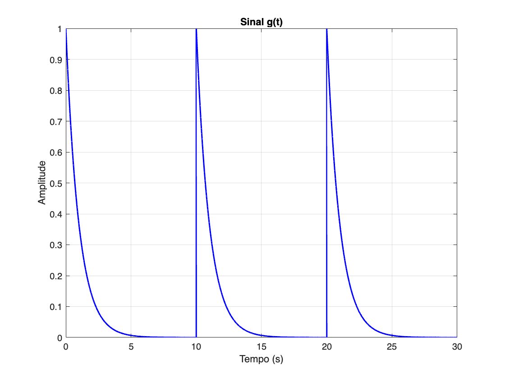

# Determinando potência


```matlab
% Inicialização de variáveis.
syms t; 
To = 10;
t0 = 0;
t1 = 10;

% Calculando o valor da potência total do sinal g(t).
Pg = 1/To * int(exp(-t)^2, t, t0, t1);
Pg
```
Pg = 
 $\displaystyle \frac{1}{20}-\frac{{\mathrm{e}}^{-20} }{20}$
 

# Análise por Fourier


```matlab
% Inicialização de variáveis.
syms n t;
w0 = (2* pi)/To;
To = 10;
t0 = 0;
t1 = 10;

Dn = 1/To * int(exp(-t) .* exp(-1*1i*n*w0*t), t, t0, t1)
```
Dn = 
 $\displaystyle -\frac{{\mathrm{e}}^{-10} \,{\mathrm{e}}^{-2\,\pi \,n\,\mathrm{i}} -1}{2\,{\left(5+\pi \,n\,\mathrm{i}\right)}}$
 

# Espéctro de amplitude de Dn:
```matlab
N=10;
n = -N:1:N;
n;

freq = linspace(-1,1,N-(-N)+1);

amplitudes=abs(eval(Dn))
```

```matlabTextOutput
amplitudes = 1x21
    0.0157    0.0174    0.0195    0.0222    0.0256    0.0303    0.0370    0.0469    0.0623    0.0847    0.1000    0.0847    0.0623    0.0469    0.0370    0.0303    0.0256    0.0222    0.0195    0.0174    0.0157

```

```matlab
for i = 1:length(amplitudes)

    if(amplitudes(i)<=0)
        amplitudes(i)=0;
    end

end 

figure
stem(freq,amplitudes, 'b', 'LineWidth', 1.5)
grid on
title('Espectro de Amplitude')
xlabel('frequência (hz)')
ylabel('Amplitudes em volts')
```

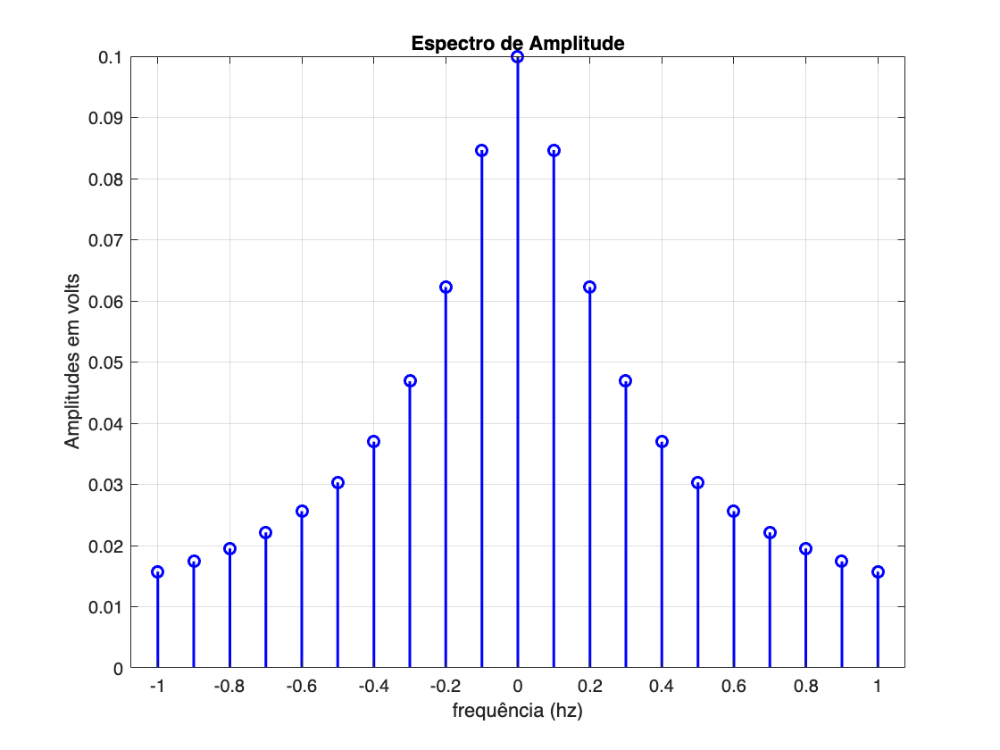

# Numérico de Dn
```matlab
Ni = -20;
Nf = 20;
n = Ni:1:Nf;
n;

num_dn = eval(Dn);
```

# Síntese do sinal


```matlab
% Declarando o número de Harmônicas:
Ni = -20;
Nf = 20;
n = Ni:1:Nf;

tempo = 0 : 1e-3 : 30;  % Define o vetor tempo

% Inicializando o sinal sintetizado
aux = 0;

% Realizando a soma da Série de Fourier
for k = 1:41  % Agora usamos o índice k para acessar os valores de n

    aux = aux + num_dn(k) * exp(1i * n(k) * w0 * tempo);  % Soma a harmônica ao sinal

end

% Plotando o sinal reconstruído
figure;
plot(tempo, real(aux), 'b', 'LineWidth', 1.5);
xlabel('Tempo (s)');
ylabel('Amplitude');
title('Reconstrução do Sinal g(t) com Séries de Fourier');
grid on;
```

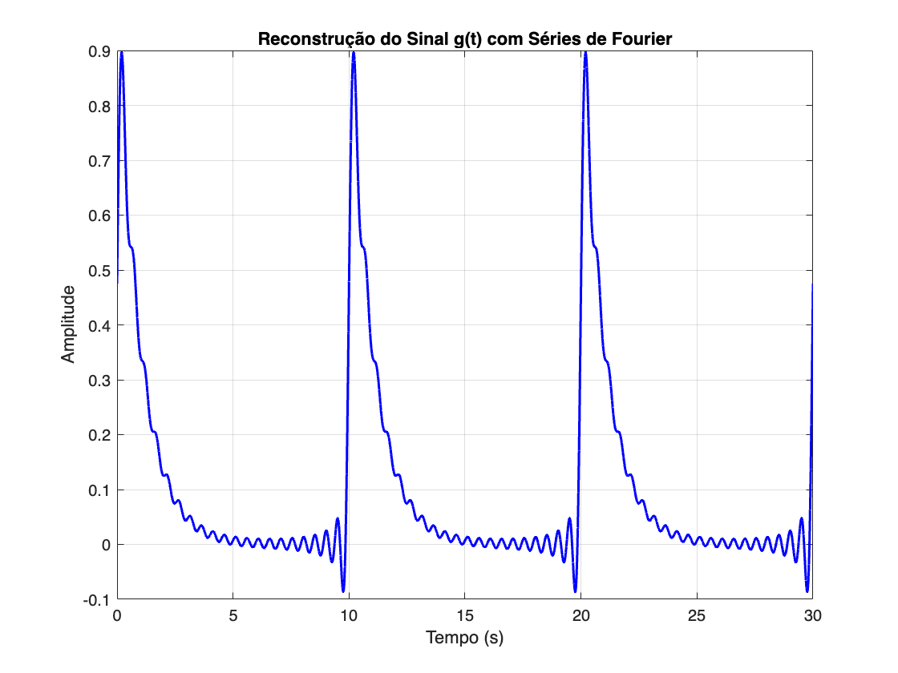

# Função para análise(fT0(t)):

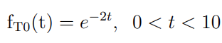

```matlab
% Numericamente o primeiro período:
t = 0 : 1e-3 : 10;
g = exp(-2*t);

% Numericamente 3 períodos:
t = 0 : 1e-3 : 30;
plot(t, [g g(2:end) g(2:end)], 'b', 'LineWidth', 1.5);
xlabel('Tempo (s)');
ylabel('Amplitude');
title('Sinal f(t)');
grid on;
```

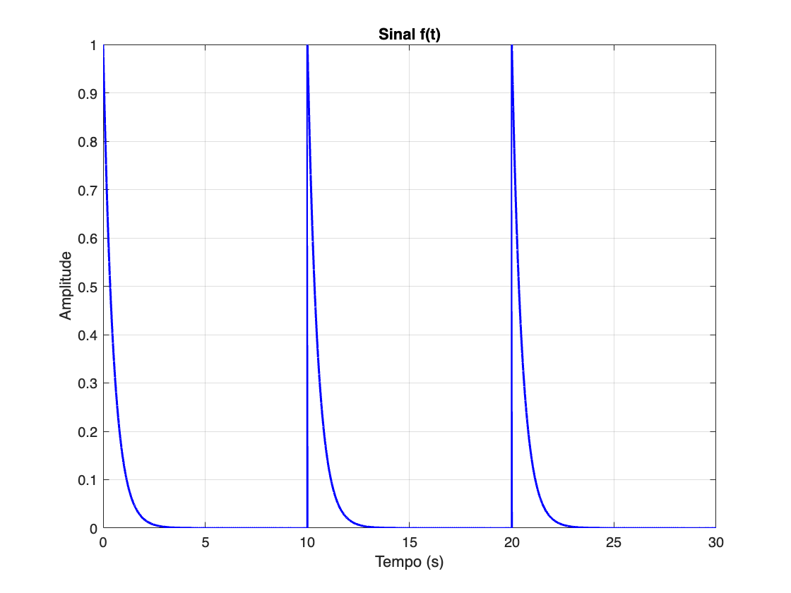

# Determinando potência


```matlab
% Inicialização de variáveis.
syms t; 
To = 10;
t0 = 0;
t1 = 10;

% Calculando o valor da potência total do sinal g(t).
Pg = 1/To * int(exp(-2*t)^2, t, t0, t1);
Pg
```
Pg = 
 $\displaystyle \frac{1}{40}-\frac{{\mathrm{e}}^{-40} }{40}$
 

# Análise por Fourier

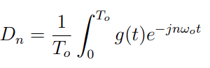

```matlab
% Inicialização de variáveis.
syms n t;
w0 = (2* pi)/To;
To = 10;
t0 = 0;
t1 = 10;

Dn = 1/To * int(exp(-2*t) .* exp(-1*1i*n*w0*t), t, t0, t1)
```
Dn = 
 $\displaystyle -\frac{{\mathrm{e}}^{-20} \,{\mathrm{e}}^{-2\,\pi \,n\,\mathrm{i}} -1}{2\,{\left(10+\pi \,n\,\mathrm{i}\right)}}$
 

# Espéctro de amplitude de Dn:
```matlab
N=10;
n = -N:1:N;
n;

freq = linspace(-1,1,N-(-N)+1);

amplitudes=abs(eval(Dn))
```

```matlabTextOutput
amplitudes = 1x21
    0.0152    0.0167    0.0185    0.0207    0.0234    0.0269    0.0311    0.0364    0.0423    0.0477    0.0500    0.0477    0.0423    0.0364    0.0311    0.0269    0.0234    0.0207    0.0185    0.0167    0.0152

```

```matlab
for i = 1:length(amplitudes)

    if(amplitudes(i)<=0)
        amplitudes(i)=0;
    end

end 

figure
stem(freq,amplitudes, 'b', 'LineWidth', 1.5)
grid on
title('Espectro de Amplitude')
xlabel('frequência (hz)')
ylabel('Amplitudes em volts')
```

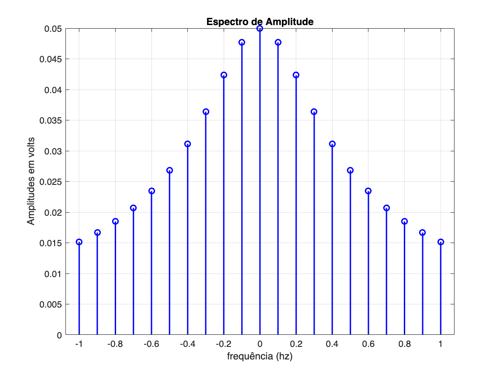

# Numérico de Dn
```matlab
Ni = -20;
Nf = 20;
n = Ni:1:Nf;
n;

num_dn = eval(Dn);
```

# Síntese do sinal


```matlab
% Declarando o número de Harmônicas:
Ni = -20;
Nf = 20;
n = Ni:1:Nf;

tempo = 0 : 1e-3 : 30;  % Define o vetor tempo

% Inicializando o sinal sintetizado
aux = 0;

% Realizando a soma da Série de Fourier
for k = 1:41  % Agora usamos o índice k para acessar os valores de n

    aux = aux + num_dn(k) * exp(1i * n(k) * w0 * tempo);  % Soma a harmônica ao sinal

end

% Plotando o sinal reconstruído
figure;
plot(tempo, real(aux), 'b', 'LineWidth', 1.5);
xlabel('Tempo (s)');
ylabel('Amplitude');
title('Reconstrução do Sinal f(t) com Séries de Fourier');
grid on;
```

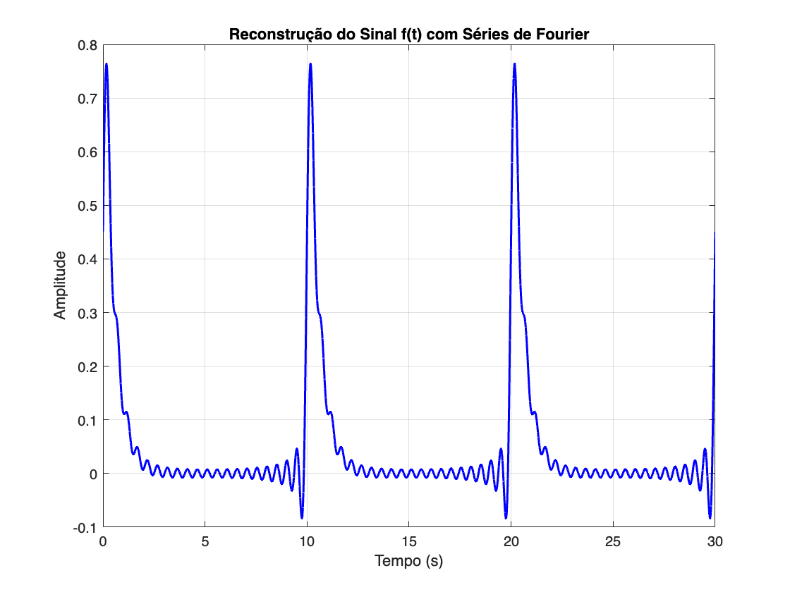

# Função para análise(fT0(t)+gT0(t)):

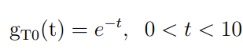


```matlab
% Numericamente o primeiro período:
t = 0 : 1e-3 : 10;
g = exp(-2*t) + exp(-t);

% Numericamente 3 períodos:
t = 0 : 1e-3 : 30;
plot(t, [g g(2:end) g(2:end)], 'b', 'LineWidth', 1.5);
xlabel('Tempo (s)');
ylabel('Amplitude');
title('Sinal f(t)+g(t)');
grid on;
```

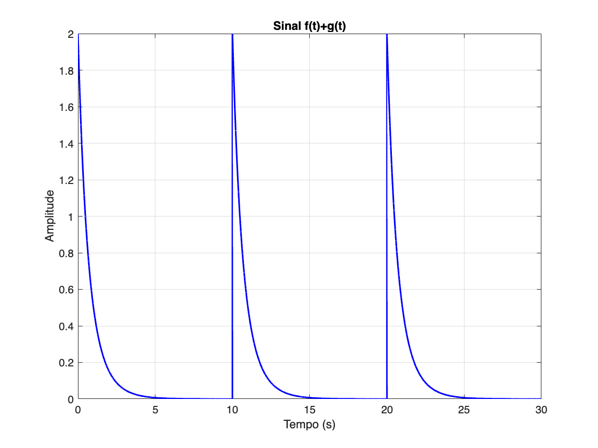

# Determinando potência

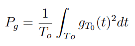

```matlab
% Inicialização de variáveis.
syms t; 
To = 10;
t0 = 0;
t1 = 10;

% Calculando o valor da potência total do sinal g(t).
Pg = 1/To * int((exp(-2*t) + exp(-t))^2, t, t0, t1)
```
Pg = 
 $\displaystyle \frac{17}{120}-\frac{{\mathrm{e}}^{-40} \,{\left(8\,{\mathrm{e}}^{10} +6\,{\mathrm{e}}^{20} +3\right)}}{120}$
 

# Análise por Fourier


```matlab
% Inicialização de variáveis.
syms n t;
w0 = (2* pi)/To;
To = 10;
t0 = 0;
t1 = 10;

Dn = 1/To * int(exp(-2*t) + exp(-t) .* exp(-1*1i*n*w0*t), t, t0, t1)
```
Dn = 
 $\displaystyle \frac{1}{20}-\frac{{\mathrm{e}}^{-10} \,{\mathrm{e}}^{-2\,\pi \,n\,\mathrm{i}} -1}{2\,{\left(5+\pi \,n\,\mathrm{i}\right)}}-\frac{{\mathrm{e}}^{-20} }{20}$
 

# Espéctro de amplitude de Dn:
```matlab
N=10;
n = -N:1:N;
n;

freq = linspace(-1,1,N-(-N)+1);

amplitudes=abs(eval(Dn))
```

```matlabTextOutput
amplitudes = 1x21
    0.0547    0.0557    0.0571    0.0590    0.0618    0.0659    0.0723    0.0830    0.1013    0.1298    0.1500    0.1298    0.1013    0.0830    0.0723    0.0659    0.0618    0.0590    0.0571    0.0557    0.0547

```

```matlab
for i = 1:length(amplitudes)

    if(amplitudes(i)<=0)
        amplitudes(i)=0;
    end

end 

figure
stem(freq,amplitudes, 'b', 'LineWidth', 1.5)
grid on
title('Espectro de Amplitude')
xlabel('frequência (hz)')
ylabel('Amplitudes em volts')
```

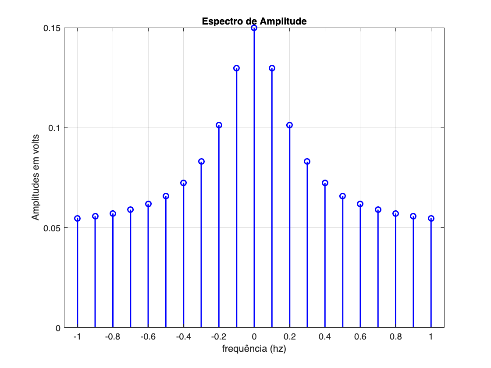

# Numérico de Dn
```matlab
Ni = -30;
Nf = 30;
n = Ni:1:Nf;
n;

num_dn = eval(Dn);
```

# Síntese do sinal

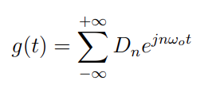

```matlab
% Declarando o número de Harmônicas:
Ni = -30;
Nf = 30;
n = Ni:1:Nf;

tempo = 0 : 1e-3 : 30;  % Define o vetor tempo

% Inicializando o sinal sintetizado
aux = 0;

% Realizando a soma da Série de Fourier
for k = 1:61  % Agora usamos o índice k para acessar os valores de n

    aux = aux + num_dn(k) * exp(1i * n(k) * w0 * tempo);  % Soma a harmônica ao sinal

end

% Plotando o sinal reconstruído
figure;
plot(tempo, real(aux), 'b', 'LineWidth', 1.5);
xlabel('Tempo (s)');
ylabel('Amplitude');
title('Reconstrução do Sinal f(t)+g(t) com Séries de Fourier');
grid on;
```

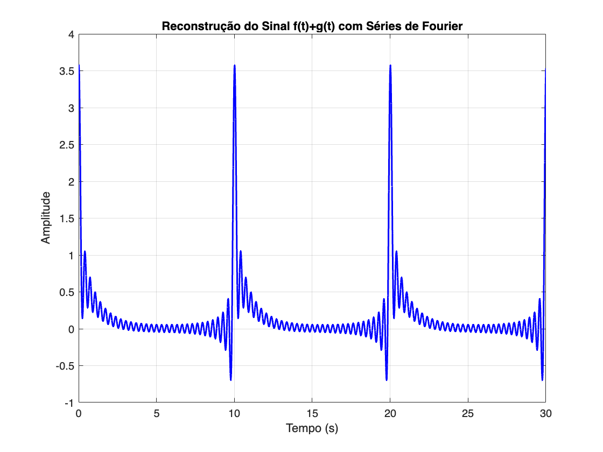

# Conclusão

Nesta análise, utilizamos a Série Trigonométrica de Fourier para estudar três funções diferentes: $g_{T0} (t)\textrm{,}\;f_{T0} (t)$ e sua soma $f_{T0} (t)+g_{T0} (t)$ . A partir dessas funções, determinamos a potência do sinal, extraímos os coeficientes de Fourier $D_n$ e visualizamos o espectro de amplitude. Por fim, sintetizamos o sinal a partir das harmônicas obtidas.


Os principais resultados foram:  


\- A decomposição espectral permitiu visualizar como a energia do sinal se distribui nas diferentes frequências.  


\- O número de harmônicas escolhidas impacta a precisão da reconstrução do sinal original.  


\- A combinação de sinais $f_{T0} (t)\;\textrm{e}\;g_{T0} (t)$ resultou em um espectro que preserva as características de ambos os sinais individuais.  


\- A reconstrução a partir das séries de Fourier foi eficiente, capturando a forma geral do sinal original, confirmando a aplicabilidade da análise de Fourier na representação de sinais periódicos.  


Esse estudo reforça a importância das séries de Fourier na análise e síntese de sinais, especialmente para aplicações em processamento digital, telecomunicações e engenharia elétrica.

