# Aula\_04\_ECM307 \- Propriedades da Série exponencial de Fourier

Felipe Fazio da Costa; RA: 23.00055\-4

<a name="beginToc"></a>

## Conteúdo
&emsp;[Boas práticas](#boas-práticas)
 
&emsp;[Função de análise(1):](#função-de-análise-1-)
 
&emsp;[Dn analítico:](#dn-analítico-)
 
&emsp;[Calculando Dn](#calculando-dn)
 
&emsp;[Calculando Pg](#calculando-pg)
 
&emsp;[Valor numérico de Dn](#valor-numérico-de-dn)
 
&emsp;[Síntese da função](#síntese-da-função)
 
&emsp;[Boas práticas](#boas-práticas)
 
&emsp;[Função de análise(2):](#função-de-análise-2-)
 
&emsp;[Dn1 e Dn2 analíticos:](#dn1-e-dn2-analíticos-)
 
&emsp;[Calculo de Dn1](#calculo-de-dn1)
 
&emsp;[Agora para a função g1(t)](#agora-para-a-função-g1-t-)
 
&emsp;[Calculando Dn0](#calculando-dn0)
 
&emsp;[Calculando Pg1](#calculando-pg1)
 
&emsp;[Valor numérico de Dn1](#valor-numérico-de-dn1)
 
&emsp;[Síntese da função](#síntese-da-função)
 
&emsp;[Função de análise(1):](#função-de-análise-1-)
 
&emsp;[Calculando Dn](#calculando-dn)
 
&emsp;[Valor numérico de Dn](#valor-numérico-de-dn)
 
&emsp;[Cálculo no número de harmônicas](#cálculo-no-número-de-harmônicas)
 
&emsp;[Determinando o coeficiente de Fourrier](#determinando-o-coeficiente-de-fourrier)
 
&emsp;[Reconstrução do sinal](#reconstrução-do-sinal)
 
&emsp;[Calculo da potência total e das bandas](#calculo-da-potência-total-e-das-bandas)
 
<a name="endToc"></a>

# Boas práticas
```matlab
% Limpando todo sistema para início dos calculos
clear;
close all;
clc;
```

# Função de análise(1):

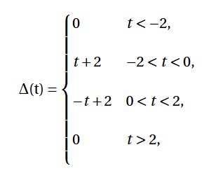

```matlab
% Numericamente o primeiro período:
t1 = -2 : 1e-3 : 0;
g1 = t1+2;

% Numericamente o segundo período:
t2 = 0 : 1e-3 : 2;
g2 = -t2+2;

% Numericamente 3 períodos:
t = -2 : 1e-3 : 2;
plot(t, [g1 g2(2:end)], 'b', 'LineWidth', 2);
xlabel('Tempo (s)');
ylabel('Amplitude');
title('Sinal g(t)');
grid on;
```

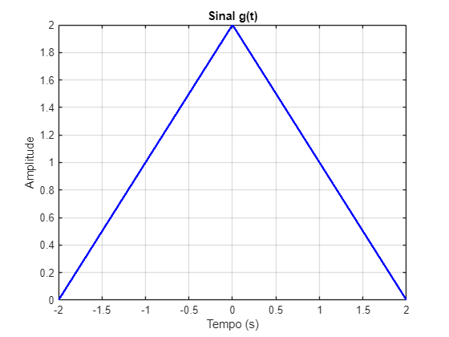

# Dn analítico:

O coeficiente da Série Exponencial de Fourier é dado por:

 $$ D_n =\frac{1}{T_0 }\int_{T_0 } g(t)e^{-jn\omega_0 t} \,dt $$ 

Para este caso, temos:

 $$ T_0 =4 $$ 

 $$ \omega_0 =\frac{2\pi }{T_0 }=\frac{\pi }{2} $$ 

O cálculo do coeficiente $D_n \,$ envolve a soma de duas integrais:

 $$ D_n =\frac{1}{4}\left(\int_{-2}^0 (t+2)e^{-jn\frac{\pi }{2}t} \,dt+\int_0^2 (-t+2)e^{-jn\frac{\pi }{2}t} \,dt\right) $$ 

Resultando em:

 $$ \textrm{Dn}=\;\frac{1}{n^2 \,\pi^2 }-\frac{\mathrm{i}}{n\,\pi }+\frac{1-{\mathrm{e}}^{\pi \,n\,\mathrm{i}} +\pi \,n\,\mathrm{i}}{n^2 \,\pi^2 }-\frac{{\mathrm{e}}^{-\pi \,n\,\mathrm{i}} }{n^2 \,\pi^2 } $$ 

# Calculando Dn


```matlab
% Declaração de variáveis:
syms n t;

To = 4;
t0 = -2;
tf = 2;
w0 = 2 * pi/ To;

% Dn simbólico
Dn = (1/To) * (int((t+2) * exp(-1 * 1i * n * w0 * t), t, t0, 0) + int((-t+2) * exp(-1 * 1i * n * w0 * t), t, 0, tf))
```
Dn = 
 $\displaystyle \frac{1}{n^2 \,\pi^2 }-\frac{\mathrm{i}}{n\,\pi }+\frac{1-{\mathrm{e}}^{\pi \,n\,\mathrm{i}} +\pi \,n\,\mathrm{i}}{n^2 \,\pi^2 }-\frac{{\mathrm{e}}^{-\pi \,n\,\mathrm{i}} }{n^2 \,\pi^2 }$
 

```matlab
D0 = (1/To) * (int((t+2) * exp(-1 * 1i * 0 * w0 * t), t, t0, 0) + int((-t+2) * exp(-1 * 1i * 0 * w0 * t), t, 0, tf))
```
D0 = 
 $\displaystyle 1$
 

# Calculando Pg


```matlab
% Declaração de variáveis:
syms n t;

To = 4;
t0 = -2;
tf = 2;
w0 = 2 * pi/ To;

% Pg simbólico
Pg = 1/To * (int((t+2)^2,  t, t0, 0) + int((t+2)^2,  t, t0, 0))
```
Pg = 
 $\displaystyle \frac{4}{3}$
 

# Valor numérico de Dn
```matlab
% Número de Dn´s

Ni = -20;
Nf = 20;
n = Ni:1:Nf;

num_dn = eval(Dn)
```

```matlabTextOutput
num_dn = 1x41 complex
   0.0000 + 0.0000i   0.0011 + 0.0000i   0.0000 + 0.0000i   0.0014 - 0.0000i   0.0000 + 0.0000i   0.0018 + 0.0000i   0.0000 + 0.0000i   0.0024 - 0.0000i   0.0000 + 0.0000i   0.0033 + 0.0000i   0.0000 + 0.0000i   0.0050 + 0.0000i   0.0000 + 0.0000i   0.0083 - 0.0000i   0.0000 + 0.0000i   0.0162 - 0.0000i   0.0000 + 0.0000i   0.0450 + 0.0000i   0.0000 + 0.0000i   0.4053 - 0.0000i      NaN -    Infi   0.4053 + 0.0000i   0.0000 - 0.0000i   0.0450 - 0.0000i   0.0000 - 0.0000i   0.0162 + 0.0000i   0.0000 - 0.0000i   0.0083 + 0.0000i   0.0000 - 0.0000i   0.0050 - 0.0000i   0.0000 - 0.0000i   0.0033 - 0.0000i   0.0000 - 0.0000i   0.0024 + 0.0000i   0.0000 - 0.0000i   0.0018 - 0.0000i   0.0000 - 0.0000i   0.0014 + 0.0000i   0.0000 - 0.0000i   0.0011 - 0.0000i   0.0000 - 0.0000i

```

```matlab
% Substituindo o not a number, sabendo o D0:
num_dn(21) = 1;
```

# Síntese da função

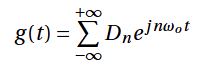

```matlab
% Declarando o número de Harmônicas:
Ni = -20;
Nf = 20;
n = Ni:1:Nf;

w0 = 2 * pi/ To;
To = 4;

tempo = -2 : 1e-3 : 10;  % Define o vetor tempo

% Inicializando o sinal sintetizado
aux = 0;

% Realizando a soma da Série de Fourier
for k = 1:41  % Agora usamos o índice k para acessar os valores de n

    aux = aux + num_dn(k) * exp(1i * n(k) * w0 * tempo);  % Soma a harmônica ao sinal

end

% Plotando o sinal reconstruído
figure;
plot(tempo, real(aux), 'b', 'LineWidth', 2);
xlabel('Tempo (s)');
ylabel('Amplitude');
title('Reconstrução do Sinal g(t) com Séries de Fourier');
grid on;
```

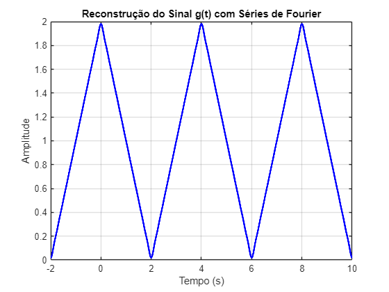

# Boas práticas
```matlab
% Limpando todo sistema para início dos calculos
clear;
close all;
clc;
```

# Função de análise(2):

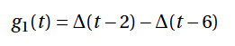

# Dn1 e Dn2 analíticos:

O sinal $g_1 (t)\;$ é dado por:

 $$ g_1 (t)=\Delta (t-2)-\Delta (t-6) $$ 

Aplicamos a propriedade de deslocamento:

 $$ D_n^{g_1 } =D_n e^{-jn\omega_0 2} -D_n e^{-jn\omega_0 6} $$ 

Com $T_0 =8$ , temos

 $$ \omega_0 =\frac{2\pi }{8}=\frac{\pi }{4} $$ 

Portanto:

 $$ D_n^{g_1 } =D_n e^{-jn\frac{\pi }{4}2} -D_n e^{-jn\frac{\pi }{4}6} $$ 

 $$ \textrm{Dn1},2=-{\textrm{e}}^{-\frac{\pi \,n\,\textrm{i}}{2}} \,{\left(\frac{\textrm{i}}{n\,\pi }-\frac{2}{n^2 \,\pi^2 }-\frac{2-2\,{\textrm{e}}^{\frac{\pi \,n\,\textrm{i}}{2}} +\pi \,n\,\textrm{i}}{n^2 \,\pi^2 }+\frac{2\,{\textrm{e}}^{-\frac{\pi \,n\,\textrm{i}}{2}} }{n^2 \,\pi^2 }\right)}\;+\;{\textrm{e}}^{-\frac{3\,\pi \,n\,\textrm{i}}{2}} \,{\left(\frac{\textrm{i}}{n\,\pi }-\frac{2}{n^2 \,\pi^2 }-\frac{2-2\,{\textrm{e}}^{\frac{\pi \,n\,\textrm{i}}{2}} +\pi \,n\,\textrm{i}}{n^2 \,\pi^2 }+\frac{2\,{\textrm{e}}^{-\frac{\pi \,n\,\textrm{i}}{2}} }{n^2 \,\pi^2 }\right)} $$ 

# Calculo de Dn1

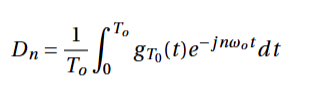

```matlab

% Declaração de variáveis:
syms n t;

To = 8;
t0 = -2;
tf = 2;
w0 = 2 * pi/ To;

% Dn simbólico
Dn = (1/To) * (int((t+2) * exp(-1 * 1i * n * w0 * t), t, t0, 0) + int((-t+2) * exp(-1 * 1i * n * w0 * t), t, 0, tf))
```
Dn = 
 $\displaystyle \frac{2}{n^2 \,\pi^2 }-\frac{\mathrm{i}}{n\,\pi }+\frac{2-2\,{\mathrm{e}}^{\frac{\pi \,n\,\mathrm{i}}{2}} +\pi \,n\,\mathrm{i}}{n^2 \,\pi^2 }-\frac{2\,{\mathrm{e}}^{-\frac{\pi \,n\,\mathrm{i}}{2}} }{n^2 \,\pi^2 }$
 

# Agora para a função g1(t)

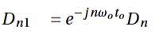

```matlab
% Fazendo o ajuste

% Declaração de variáveis
to = 2;
to2 = 6;

To = 8;
w0 = 2 * pi/ To;

Dn1 = Dn * exp(-1 * 1i * n * w0 * to)
```
Dn1 = 
 $\displaystyle -{\mathrm{e}}^{-\frac{\pi \,n\,\mathrm{i}}{2}} \,{\left(\frac{\mathrm{i}}{n\,\pi }-\frac{2}{n^2 \,\pi^2 }-\frac{2-2\,{\mathrm{e}}^{\frac{\pi \,n\,\mathrm{i}}{2}} +\pi \,n\,\mathrm{i}}{n^2 \,\pi^2 }+\frac{2\,{\mathrm{e}}^{-\frac{\pi \,n\,\mathrm{i}}{2}} }{n^2 \,\pi^2 }\right)}$
 

```matlab
Dn2 = Dn * exp(-1 * 1i * n * w0 * to2)
```
Dn2 = 
 $\displaystyle -{\mathrm{e}}^{-\frac{3\,\pi \,n\,\mathrm{i}}{2}} \,{\left(\frac{\mathrm{i}}{n\,\pi }-\frac{2}{n^2 \,\pi^2 }-\frac{2-2\,{\mathrm{e}}^{\frac{\pi \,n\,\mathrm{i}}{2}} +\pi \,n\,\mathrm{i}}{n^2 \,\pi^2 }+\frac{2\,{\mathrm{e}}^{-\frac{\pi \,n\,\mathrm{i}}{2}} }{n^2 \,\pi^2 }\right)}$
 

# Calculando Dn0
```matlab
% Declaração de variáveis:
syms t;

To = 8;
w0 = 2 * pi/ To;
to = -2;
to2 = -6;

t0 = -2;
tf = 2;

D0 = (1/To) * (int((t+2) * exp(-1 * 1i * 0 * w0 * t), t, t0, 0) + int((-t+2) * exp(-1 * 1i * 0 * w0 * t), t, 0, tf))
```
D0 = 
 $\displaystyle \frac{1}{2}$
 

```matlab

Dn0_1 = D0 * exp(-1 * 1i * 0 * w0 * to)
```
Dn0_1 = 
 $\displaystyle \frac{1}{2}$
 

```matlab
Dn0_2 = D0 * exp(-1 * 1i * 0 * w0 * to2)
```
Dn0_2 = 
 $\displaystyle \frac{1}{2}$
 

# Calculando Pg1

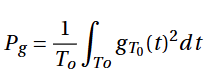

```matlab
% Declaração de variáveis:
syms n t;

To = 8;
t0 = -2;
tf = 2;
w0 = 2 * pi/ To;

% Pg simbólico
Pg1 = 1/To * int((t-2)^2,  t, t0, 0);
Pg2 = 1/To * int((t-4)^2,  t, 0, tf);

% Pg total:
Pgt = Pg1 - Pg2
```
Pgt = 
 $\displaystyle 0$
 

# Valor numérico de Dn1
```matlab
% Número de Dn´s

Ni = -20;
Nf = 20;
n = Ni:1:Nf;

num_dn1 = eval(Dn1)
```

```matlabTextOutput
num_dn1 = 1x41 complex
   0.0000 + 0.0000i  -0.0000 - 0.0011i  -0.0025 - 0.0000i  -0.0000 + 0.0014i   0.0000 + 0.0000i  -0.0000 - 0.0018i  -0.0041 + 0.0000i   0.0000 + 0.0024i   0.0000 + 0.0000i   0.0000 - 0.0033i  -0.0081 + 0.0000i  -0.0000 + 0.0050i   0.0000 + 0.0000i  -0.0000 - 0.0083i  -0.0225 + 0.0000i   0.0000 + 0.0162i   0.0000 + 0.0000i   0.0000 - 0.0450i  -0.2026 + 0.0000i   0.0000 + 0.4053i      NaN +    NaNi   0.0000 - 0.4053i  -0.2026 - 0.0000i   0.0000 + 0.0450i   0.0000 - 0.0000i   0.0000 - 0.0162i  -0.0225 - 0.0000i  -0.0000 + 0.0083i   0.0000 - 0.0000i  -0.0000 - 0.0050i  -0.0081 - 0.0000i   0.0000 + 0.0033i   0.0000 - 0.0000i   0.0000 - 0.0024i  -0.0041 - 0.0000i  -0.0000 + 0.0018i   0.0000 - 0.0000i  -0.0000 - 0.0014i  -0.0025 + 0.0000i  -0.0000 + 0.0011i   0.0000 - 0.0000i

```

```matlab
num_dn2 = eval(Dn2)
```

```matlabTextOutput
num_dn2 = 1x41 complex
   0.0000 + 0.0000i   0.0000 + 0.0011i  -0.0025 + 0.0000i   0.0000 - 0.0014i   0.0000 + 0.0000i   0.0000 + 0.0018i  -0.0041 - 0.0000i   0.0000 - 0.0024i   0.0000 + 0.0000i   0.0000 + 0.0033i  -0.0081 + 0.0000i  -0.0000 - 0.0050i   0.0000 + 0.0000i  -0.0000 + 0.0083i  -0.0225 + 0.0000i  -0.0000 - 0.0162i   0.0000 + 0.0000i   0.0000 + 0.0450i  -0.2026 + 0.0000i  -0.0000 - 0.4053i      NaN +    NaNi  -0.0000 + 0.4053i  -0.2026 - 0.0000i   0.0000 - 0.0450i   0.0000 - 0.0000i  -0.0000 + 0.0162i  -0.0225 - 0.0000i  -0.0000 - 0.0083i   0.0000 - 0.0000i  -0.0000 + 0.0050i  -0.0081 - 0.0000i   0.0000 - 0.0033i   0.0000 - 0.0000i   0.0000 + 0.0024i  -0.0041 + 0.0000i   0.0000 - 0.0018i   0.0000 - 0.0000i   0.0000 + 0.0014i  -0.0025 - 0.0000i   0.0000 - 0.0011i   0.0000 - 0.0000i

```

```matlab

% Substituindo o not a number, sabendo o D0:
num_dn1(21) = Dn0_1;
num_dn2(21) = Dn0_2;
```

# Síntese da função


```matlab
% Declarando o número de Harmônicas:
Ni = -20;
Nf = 20;
n = Ni:1:Nf;

To = 8;
w0 = 2 * pi/ To;

tempo = 0 : 1e-3 : 8;  % Define o vetor tempo

% Inicializando o sinal sintetizado
aux = 0;

% Realizando a soma da Série de Fourier
for k = 1:41  % Agora usamos o índice k para acessar os valores de n

    aux = aux + num_dn1(k) * exp(1i * n(k) * w0 * tempo);  % Soma a harmônica ao sinal
    aux = aux - num_dn2(k) * exp(1i * n(k) * w0 * tempo);  % Soma a harmônica ao sinal

end

% Plotando o sinal reconstruído
Dn_sintetizado = aux;
figure;
plot(tempo, real(Dn_sintetizado), 'b', 'LineWidth', 2);
xlabel('Tempo (s)');
ylabel('Amplitude');
title('Reconstrução do Sinal g(t) com Séries de Fourier');
grid on;
```

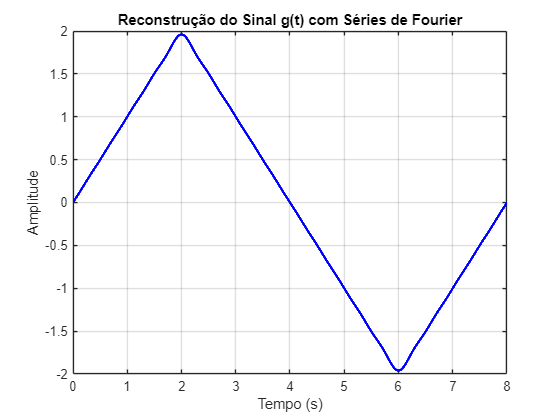

# Função de análise(1):


```matlab
% Numericamente o primeiro período:
t1 = -2 : 1e-3 : 0;
g1 = t1+2;

% Numericamente o segundo período:
t2 = 0 : 1e-3 : 2;
g2 = -t2+2;

% Numericamente 3 períodos:
t = -2 : 1e-3 : 2;
plot(t, [g1 g2(2:end)], 'r', 'LineWidth', 2);
xlabel('Tempo (s)');
ylabel('Amplitude');
title('Sinal g(t)');
grid on;
```

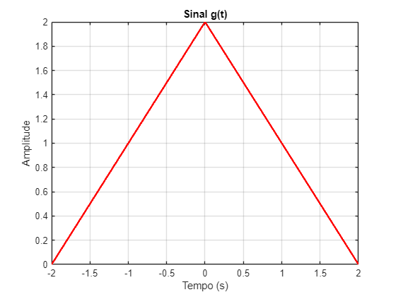

# Calculando Dn


```matlab
% Declaração de variáveis:
syms n t;

To = 4;
t0 = -2;
tf = 2;
w0 = 2 * pi/ To;

% Dn simbólico
Dn = (1/To) * (int((t+2) * exp(-1 * 1i * n * w0 * t), t, t0, 0) + int((-t+2) * exp(-1 * 1i * n * w0 * t), t, 0, tf))
```
Dn = 
 $\displaystyle \frac{1}{n^2 \,\pi^2 }-\frac{\mathrm{i}}{n\,\pi }+\frac{1-{\mathrm{e}}^{\pi \,n\,\mathrm{i}} +\pi \,n\,\mathrm{i}}{n^2 \,\pi^2 }-\frac{{\mathrm{e}}^{-\pi \,n\,\mathrm{i}} }{n^2 \,\pi^2 }$
 

```matlab
D0 = (1/To) * (int((t+2) * exp(-1 * 1i * 0 * w0 * t), t, t0, 0) + int((-t+2) * exp(-1 * 1i * 0 * w0 * t), t, 0, tf))
```
D0 = 
 $\displaystyle 1$
 

# Valor numérico de Dn
```matlab
% Número de Dn´s

Ni = -10000;
Nf = 10000;
n = Ni:1:Nf;

num_dn = eval(Dn)
```

```matlabTextOutput
num_dn = 1x20001 complex
   0.0000 + 0.0000i   0.0000 + 0.0000i   0.0000 + 0.0000i   0.0000 - 0.0000i   0.0000 + 0.0000i   0.0000 - 0.0000i   0.0000 + 0.0000i   0.0000 - 0.0000i   0.0000 - 0.0000i   0.0000 - 0.0000i   0.0000 + 0.0000i   0.0000 + 0.0000i   0.0000 - 0.0000i   0.0000 + 0.0000i   0.0000 + 0.0000i   0.0000 + 0.0000i   0.0000 + 0.0000i   0.0000 - 0.0000i   0.0000 + 0.0000i   0.0000 - 0.0000i   0.0000 - 0.0000i   0.0000 - 0.0000i   0.0000 + 0.0000i   0.0000 + 0.0000i   0.0000 + 0.0000i   0.0000 - 0.0000i   0.0000 + 0.0000i   0.0000 - 0.0000i   0.0000 + 0.0000i   0.0000 - 0.0000i   0.0000 - 0.0000i   0.0000 - 0.0000i   0.0000 + 0.0000i   0.0000 + 0.0000i   0.0000 + 0.0000i   0.0000 + 0.0000i   0.0000 + 0.0000i   0.0000 - 0.0000i   0.0000 + 0.0000i   0.0000 - 0.0000i   0.0000 + 0.0000i   0.0000 - 0.0000i   0.0000 - 0.0000i   0.0000 + 0.0000i   0.0000 + 0.0000i   0.0000 - 0.0000i   0.0000 + 0.0000i   0.0000 + 0.0000i   0.0000 + 0.0000i   0.0000 - 0.0000i

```

```matlab
% Substituindo o not a number, sabendo o D0:
num_dn(10001) = 1;

```

# Cálculo no número de harmônicas
```matlab
% Parâmetros do problema
f_banda = 2500; % Hz (frequência máxima da banda)
T0_values = [4, 0.4, 0.04]; % Valores de período a serem analisados

% Cálculo do número de harmônicas N para cada período
for i = 1:length(T0_values)
    T0 = T0_values(i);
    
    % Frequência fundamental
    f0 = 1/T0; % em Hz
    
    % Número de harmônicas necessárias
    N = floor(f_banda / f0);
    
    fprintf('Para T0 = %.2f s:\n', T0);
    fprintf('  Frequência fundamental f0 = %.2f Hz\n', f0);
    fprintf('  Número de harmônicas N = %d\n', N);
    fprintf('  Frequência máxima da banda: %.2f Hz\n\n', N*f0);
end
```

```matlabTextOutput
Para T0 = 4.00 s:
  Frequência fundamental f0 = 0.25 Hz
  Número de harmônicas N = 10000
  Frequência máxima da banda: 2500.00 Hz
Para T0 = 0.40 s:
  Frequência fundamental f0 = 2.50 Hz
  Número de harmônicas N = 1000
  Frequência máxima da banda: 2500.00 Hz
Para T0 = 0.04 s:
  Frequência fundamental f0 = 25.00 Hz
  Número de harmônicas N = 100
  Frequência máxima da banda: 2500.00 Hz
```

# Determinando o coeficiente de Fourrier
```matlab
syms t n T0
T0 = 4; % Período
w0 = 2*pi/T0; % Frequência angular fundamental

% Definição do sinal triangular
Delta_t = piecewise(t < -2, 0, -2 <= t < 0, t+2, 0 <= t < 2, -t+2, t >= 2, 0);

% Cálculo do coeficiente de Fourier para n ≠ 0
Dn = (1/T0) * int(Delta_t * exp(-1j * n * w0 * t), t, -T0/2, T0/2);
Dn = simplify(Dn); % Simplificação da expressão

% Cálculo do termo D0 separadamente
D0 = (1/T0) * int(Delta_t, t, -T0/2, T0/2);

% Avaliação numérica dos coeficientes para n de -10 a 10
n_vals = -10:10;
Dn_vals = zeros(size(n_vals)); % Inicializa o vetor de coeficientes

for k = 1:length(n_vals)
    if n_vals(k) == 0
        Dn_vals(k) = double(D0); % Atribui D0 quando n = 0
    else
        Dn_vals(k) = double(subs(Dn, n, n_vals(k))); % Substitui os valores de n nos coeficientes
    end
end

% Criando subplots
figure;

% Subplot 1: Sinal original
subplot(2,1,1);
fplot(Delta_t, [-T0, T0], 'LineWidth', 2);
xlabel('Tempo (s)');
ylabel('Amplitude');
title('Sinal Original g(t)');
grid on;

% Subplot 2: Coeficientes da Série de Fourier
subplot(2,1,2);
stem(n_vals, abs(Dn_vals), 'r', 'filled');
xlabel('Ordem Harmônica (n)');
ylabel('|Dn|');
title('Coeficientes da Série de Fourier');
grid on;
```

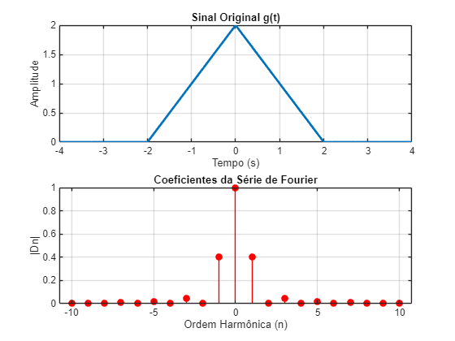

# Reconstrução do sinal
```matlab
syms t n T0
T0 = 4; % Período
w0 = 2*pi/T0; % Frequência angular fundamental

% Definição do sinal triangular
Delta_t = piecewise(t < -2, 0, -2 <= t < 0, t+2, 0 <= t < 2, -t+2, t >= 2, 0);

% Cálculo dos coeficientes da Série de Fourier
Dn = (1/T0) * int(Delta_t * exp(-1j * n * w0 * t), t, -T0/2, T0/2);
Dn = simplify(Dn);

% Cálculo do termo D0 separadamente
D0 = (1/T0) * int(Delta_t, t, -T0/2, T0/2);

% Definição da largura de banda e número de harmônicas
f_banda = 2500; % Hz (frequência máxima)
T0_values = [4, 0.4, 0.04]; % Diferentes períodos a analisar

for i = 1:length(T0_values)
    T0 = T0_values(i);
    w0 = 2*pi/T0; % Atualiza frequência angular fundamental
    f0 = 1/T0; % Frequência fundamental
    N = floor(f_banda / f0); % Número de harmônicas baseado na banda

    % Vetor de tempo para reconstrução
    tempo = linspace(-T0, T0, 1000);

    % Inicialização do sinal sintetizado
    sinal_reconstruido = zeros(size(tempo));

    % Cálculo da soma da Série de Fourier
    for k = -N:N
        if k == 0
            Dn_k = double(D0);
        else
            Dn_k = double(subs(Dn, n, k));
        end
        sinal_reconstruido = sinal_reconstruido + Dn_k * exp(1j * k * w0 * tempo);
    end

    % Criando a comparação gráfica
    figure;
    
    % Subplot 1: Sinal Original
    subplot(2,1,1);
    fplot(Delta_t, [-T0, T0], 'LineWidth', 2);
    xlabel('Tempo (s)');
    ylabel('Amplitude');
    title(['Sinal Original g(t) para T0 = ', num2str(T0)]);
    grid on;

    % Subplot 2: Sinal Reconstruído
    subplot(2,1,2);
    plot(tempo, real(sinal_reconstruido), 'r', 'LineWidth', 2);
    xlabel('Tempo (s)');
    ylabel('Amplitude');
    title(['Reconstrução do Sinal g(t) com N = ', num2str(N), ' Harmônicas']);
    grid on;
end
```

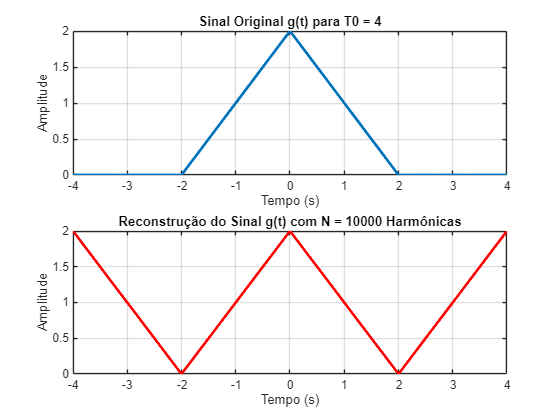

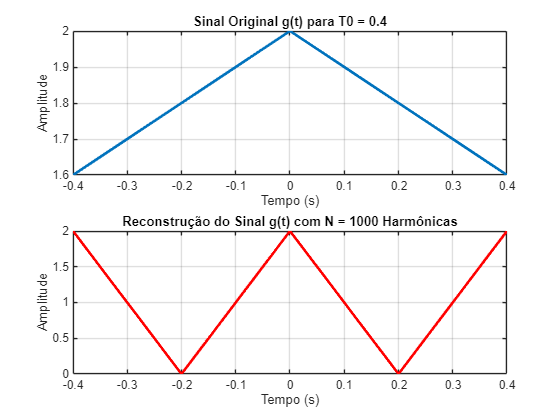

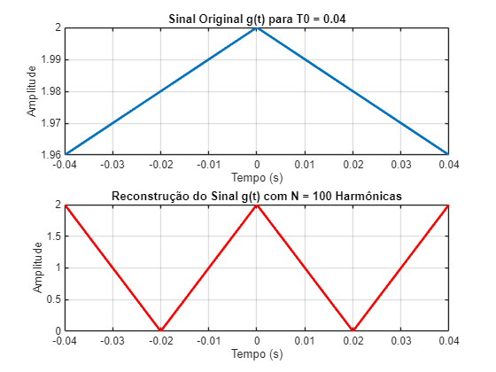

# Calculo da potência total e das bandas
```matlab
syms t n T0
T0 = 4; % Período base
w0 = 2*pi/T0; % Frequência angular fundamental

% Definição do sinal triangular
Delta_t = piecewise(t < -2, 0, -2 <= t < 0, t+2, 0 <= t < 2, -t+2, t >= 2, 0);

% Cálculo dos coeficientes de Fourier
Dn = (1/T0) * int(Delta_t * exp(-1j * n * w0 * t), t, -T0/2, T0/2);
Dn = simplify(Dn);

% Cálculo de D0 (coeficiente DC)
D0 = (1/T0) * int(Delta_t, t, -T0/2, T0/2);

% Diferentes períodos a serem analisados
T0_values = [4, 0.4, 0.04]; % Diferentes valores de T0
f_banda = 2500; % Hz (limitação da banda)

for i = 1:length(T0_values)
    T0 = T0_values(i);
    w0 = 2*pi/T0;
    f0 = 1/T0;
    N = floor(f_banda / f0); % Número de harmônicas baseado na banda

    % Cálculo dos coeficientes de Fourier para -N a N
    Dn_vals = zeros(1, 2*N+1);
    indices = -N:N;
    
    for j = 1:length(indices)
        k = indices(j);
        if k == 0
            Dn_vals(j) = double(D0);
        else
            Dn_vals(j) = double(subs(Dn, n, k));
        end
    end

    % Cálculo da potência total (somatório de todos os |Dn|^2)
    potencia_total = sum(abs(Dn_vals).^2);
    
    % Cálculo da energia acumulada até N harmônicas
    energia_acumulada = cumsum(abs(Dn_vals).^2);

    % Exibindo resultados
    fprintf('Para T0 = %.2f:\n', T0);
    fprintf('Potência total do sinal: %.5f\n', potencia_total);
    fprintf('Energia contida nas bandas para N = %d: %.5f\n', N, energia_acumulada(end));
    fprintf('------------------------------------\n');
end
```

```matlabTextOutput
Para T0 = 4.00:
Potência total do sinal: 1.33333
Energia contida nas bandas para N = 10000: 1.33333
------------------------------------
Para T0 = 0.40:
Potência total do sinal: 1.33333
Energia contida nas bandas para N = 1000: 1.33333
------------------------------------
Para T0 = 0.04:
Potência total do sinal: 1.33333
Energia contida nas bandas para N = 100: 1.33333
------------------------------------
```
