# Aula\_04\_ECM307 \- Propriedades da Série exponencial de Fourier

Felipe Fazio da Costa; RA: 23.00055\-4

<a name="beginToc"></a>

## Conteúdo
&emsp;[Boas práticas](#boas-práticas)
 
&emsp;[Função de análise(1):](#função-de-análise-1-)
 
&emsp;[Cálculo do valor médio](#cálculo-do-valor-médio)
 
&emsp;[Cálculo do valor eficaz](#cálculo-do-valor-eficaz)
 
&emsp;[Dn simbólico(1 e 2)](#dn-simbólico-1-e-2-)
 
&emsp;[Cálculo numérico dos Dn´s](#cálculo-numérico-dos-dn-s)
 
&emsp;[Síntese da função](#síntese-da-função)
 
&emsp;[Síntese da função somando\-as](#síntese-da-função-somando-as)
 
&emsp;[Valor numérico de Dn](#valor-numérico-de-dn)
 
&emsp;[Função de análise(2)](#função-de-análise-2-)
 
&emsp;[Cálculo do valor médio](#cálculo-do-valor-médio)
 
&emsp;[Cálculo do valor eficaz](#cálculo-do-valor-eficaz)
 
&emsp;[Deslocamento da função g1](#deslocamento-da-função-g1)
 
&emsp;[Calculando valor médio de delta(t \-2)](#calculando-valor-médio-de-delta-t-2-)
 
&emsp;[Calculando valor eficaz de delta(t \-2)](#calculando-valor-eficaz-de-delta-t-2-)
 
&emsp;[Calculando valor médio de delta(t \-6)](#calculando-valor-médio-de-delta-t-6-)
 
&emsp;[Calculando valor eficaz de delta(t \-6)](#calculando-valor-eficaz-de-delta-t-6-)
 
&emsp;[Deslocamento da função g2](#deslocamento-da-função-g2)
 
&emsp;[Calculando valor médio de delta(t \-2)](#calculando-valor-médio-de-delta-t-2-)
 
&emsp;[Calculando valor eficaz de delta(t \-2)](#calculando-valor-eficaz-de-delta-t-2-)
 
&emsp;[Calculando valor médio de delta(t \-4)](#calculando-valor-médio-de-delta-t-4-)
 
&emsp;[Calculando valor eficaz de delta(t \-4)](#calculando-valor-eficaz-de-delta-t-4-)
 
&emsp;[Corelação Cruzada](#corelação-cruzada)
 
&emsp;[Potência do sinal g(t) em função de a](#potência-do-sinal-g-t-em-função-de-a)
 
&emsp;[Coeficientes Dn da Série de Fourier para a = 2](#coeficientes-dn-da-série-de-fourier-para-a-2)
 
&emsp;[Determinar N tal que potência acumulada seja 95% da original](#determinar-n-tal-que-potência-acumulada-seja-95-da-original)
 
&emsp;[Comparação dos sinais](#comparação-dos-sinais)
 
&emsp;[Sinal ∆(t) e sua derivada q(t)](#sinal-t-e-sua-derivada-q-t-)
 
&emsp;[Coeficientes Dn da série de Fourier de ∆(t)](#coeficientes-dn-da-série-de-fourier-de-t-)
 
&emsp;[Síntese com Dnmod = jn\*w0\*Dn](#síntese-com-dnmod-jn-w0-dn)
 
&emsp;[Síntese com Dnmod = \-n²\*w0²\*Dn](#síntese-com-dnmod-n-w0-dn)
 
&emsp;[Síntese com Dnmod = Dn / (jn\*w0)](#síntese-com-dnmod-dn-jn-w0-)
 
<a name="endToc"></a>

# Boas práticas
```matlab
% Limpando todo sistema para início dos calculos
clear;
close all;
clc;
```

# Função de análise(1):

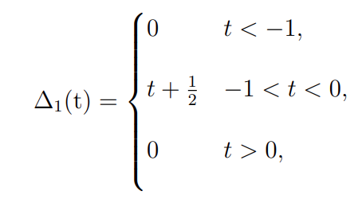                                       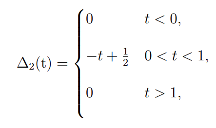


```matlab
% Numericamente o primeiro período:
t1 = -1 : 1e-3 : 0;
g1 = t1+1/2;

% Numericamente o segundo período:
t2 = 0 : 1e-3 : 1;
g2 = -t2+1/2;

% Numericamente 3 períodos:
t = -1 : 1e-3 : 2;
plot(t, [g1 g1(2:end) g1(2:end)], 'b', 'LineWidth', 2);
xlabel('Tempo (s)');
ylabel('Amplitude');
title('Sinal Delta1(t)');
grid on;
```

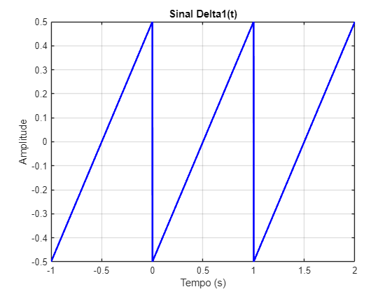

```matlab

% Numericamente 3 períodos:
t = -1 : 1e-3 : 2;
plot(t, [g2 g2(2:end) g2(2:end)], 'r', 'LineWidth', 2);
xlabel('Tempo (s)');
ylabel('Amplitude');
title('Sinal Delta2(t)');
grid on;
```

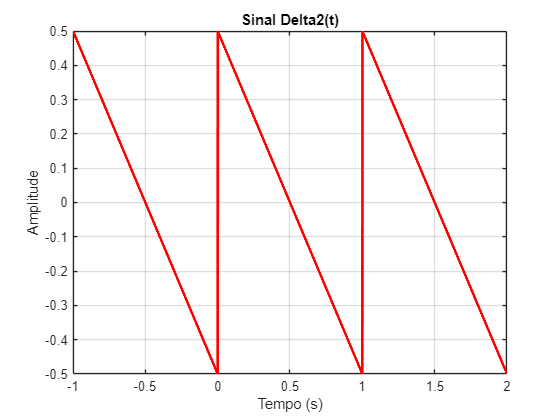

# Cálculo do valor médio

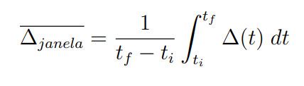

```matlab
% Para o delta 1
% Declaração de variáveis
syms t;
tf = 0;
ti = -1;

Del_janela_1 = 1/(tf-ti) * int(t+1/2, t, tf, ti)
```
Del_janela_1 = 
 $\displaystyle 0$
 

```matlab
% Para o delta 2
% Declaração de variáveis
syms t;
tf = 1;
ti = 0;

Del_janela_2 = 1/(tf-ti) * int(-t+1/2, t, ti, tf)
```
Del_janela_2 = 
 $\displaystyle 0$
 

# Cálculo do valor eficaz

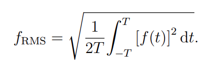

```matlab
% Para o f1
% Declaração de variáveis
syms t;
T = 1;

f1 = sqrt(1/(2*T) * int((t+1/2)^2, t, -T, T))
```
f1 = 
 $\displaystyle \frac{\sqrt{3}\,\sqrt{7}}{6}$
 

```matlab
% Para o f2
% Declaração de variáveis
syms t;
T = 1;

f2 = sqrt(1/(2*T) * int((-t+1/2)^2, t, -T, T))
```
f2 = 
 $\displaystyle \frac{\sqrt{3}\,\sqrt{7}}{6}$
 

*`Valor continuo inegrado que dissipa a mesma potência.`*

```matlab
% Razão entre o V de pico e V de rms
Relacao1 = max(g1)/f1
```
Relacao1 = 
 $\displaystyle \frac{\sqrt{3}\,\sqrt{7}}{7}$
 

```matlab
% Razão entre o V de pico e V de rms
Relacao2 = max(g2)/f2
```
Relacao2 = 
 $\displaystyle \frac{\sqrt{3}\,\sqrt{7}}{7}$
 

*`Pode-se concluir que as razões entre elas são equivalentes por terem um valor de eficacia equivalentes. Quando comparamos com o valor médio pode-se concluir que é um número que não é importante para a análise do nosso sistema.`*

# Dn simbólico(1 e 2)

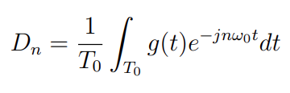

```matlab
% Declaração de variáveis:(1)
syms n t;

To = 1;
t0 = -1;
tf = 0;
w0 = 2 * pi/ To;

% Dn simbólico
Dn1 = (1/To) * int((t+1/2) * exp(-1 * 1i * n * w0 * t), t, t0, tf)
```
Dn1 = 
 $\displaystyle \frac{\frac{1}{4}+\pi \,n\,{\left(\frac{{\mathrm{e}}^{2\,\pi \,n\,\mathrm{i}} \,\mathrm{i}}{4}+\frac{1}{4}\,\mathrm{i}\right)}-\frac{{\mathrm{e}}^{2\,\pi \,n\,\mathrm{i}} }{4}}{n^2 \,\pi^2 }$
 

```matlab

D0_1 = (1/To) * int((t+1/2) * exp(-1 * 1i * 0 * w0 * t), t, t0, tf)
```
D0_1 = 
 $\displaystyle 0$
 

```matlab
% Declaração de variáveis:(2)
syms n t;

To = 1;
t0 = 0;
tf = 1;
w0 = 2 * pi/ To;

% Dn simbólico
Dn2 = (1/To) * int((-t+1/2) * exp(-1 * 1i * n * w0 * t), t, t0, tf)
```
Dn2 = 
 $\displaystyle \frac{1}{4\,n^2 \,\pi^2 }+\frac{{\left({\mathrm{e}}^{-2\,\pi \,n\,\mathrm{i}} -1\right)}\,\mathrm{i}}{4\,n\,\pi }-\frac{{\mathrm{e}}^{-2\,\pi \,n\,\mathrm{i}} \,{\left(1+2\,\pi \,n\,\mathrm{i}\right)}}{4\,n^2 \,\pi^2 }$
 

```matlab

D0_2 = (1/To) * int((-t+1/2) * exp(-1 * 1i * 0 * w0 * t), t, t0, tf)
```
D0_2 = 
 $\displaystyle 0$
 

# Cálculo numérico dos Dn´s
```matlab
% Número de Dn´s

Ni = -20;
Nf = 20;
n = Ni:1:Nf;

% Para o Dn1

num_dn1 = eval(Dn1);

% Substituindo o not a number, sabendo o D0:
num_dn1(21) = D0_1
```

```matlabTextOutput
num_dn1 = 1x41 complex
   0.0000 - 0.0080i   0.0000 - 0.0084i   0.0000 - 0.0088i  -0.0000 - 0.0094i   0.0000 - 0.0099i   0.0000 - 0.0106i   0.0000 - 0.0114i  -0.0000 - 0.0122i   0.0000 - 0.0133i   0.0000 - 0.0145i   0.0000 - 0.0159i   0.0000 - 0.0177i   0.0000 - 0.0199i   0.0000 - 0.0227i   0.0000 - 0.0265i   0.0000 - 0.0318i   0.0000 - 0.0398i   0.0000 - 0.0531i   0.0000 - 0.0796i   0.0000 - 0.1592i   0.0000 + 0.0000i   0.0000 + 0.1592i   0.0000 + 0.0796i   0.0000 + 0.0531i   0.0000 + 0.0398i   0.0000 + 0.0318i   0.0000 + 0.0265i   0.0000 + 0.0227i   0.0000 + 0.0199i   0.0000 + 0.0177i   0.0000 + 0.0159i   0.0000 + 0.0145i   0.0000 + 0.0133i  -0.0000 + 0.0122i   0.0000 + 0.0114i   0.0000 + 0.0106i   0.0000 + 0.0099i  -0.0000 + 0.0094i   0.0000 + 0.0088i   0.0000 + 0.0084i   0.0000 + 0.0080i

```

```matlab
% Para o Dn2

num_dn2 = eval(Dn2);

% Substituindo o not a number, sabendo o D0:
num_dn2(21) = D0_2
```

```matlabTextOutput
num_dn2 = 1x41 complex
   0.0000 + 0.0080i   0.0000 + 0.0084i   0.0000 + 0.0088i  -0.0000 + 0.0094i   0.0000 + 0.0099i   0.0000 + 0.0106i   0.0000 + 0.0114i  -0.0000 + 0.0122i   0.0000 + 0.0133i   0.0000 + 0.0145i   0.0000 + 0.0159i   0.0000 + 0.0177i   0.0000 + 0.0199i   0.0000 + 0.0227i   0.0000 + 0.0265i   0.0000 + 0.0318i   0.0000 + 0.0398i   0.0000 + 0.0531i   0.0000 + 0.0796i   0.0000 + 0.1592i   0.0000 + 0.0000i   0.0000 - 0.1592i   0.0000 - 0.0796i   0.0000 - 0.0531i   0.0000 - 0.0398i   0.0000 - 0.0318i   0.0000 - 0.0265i   0.0000 - 0.0227i   0.0000 - 0.0199i   0.0000 - 0.0177i   0.0000 - 0.0159i   0.0000 - 0.0145i   0.0000 - 0.0133i  -0.0000 - 0.0122i   0.0000 - 0.0114i   0.0000 - 0.0106i   0.0000 - 0.0099i  -0.0000 - 0.0094i   0.0000 - 0.0088i   0.0000 - 0.0084i   0.0000 - 0.0080i

```

# Síntese da função

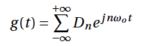

```matlab
% Função 1
% Declarando o número de Harmônicas:
Ni = -20;
Nf = 20;
n = Ni:1:Nf;

To = 1;

w0 = 2 * pi/ To;

tempo = -1 : 1e-3 : 2;  % Define o vetor tempo

% Inicializando o sinal sintetizado
aux1 = 0;

% Realizando a soma da Série de Fourier
for k = 1:41  % Agora usamos o índice k para acessar os valores de n

    aux1 = aux1 + num_dn1(k) * exp(1i * n(k) * w0 * tempo);  % Soma a harmônica ao sinal

end

% Plotando o sinal reconstruído
figure;
plot(tempo, real(aux1), 'b', 'LineWidth', 2);
xlabel('Tempo (s)');
ylabel('Amplitude');
title('Reconstrução do Sinal g(t) com Séries de Fourier');
grid on;
hold on;
% Numericamente o primeiro período:
t1 = -1 : 1e-3 : 0;
g1 = t1+1/2;

% Numericamente 3 períodos:
t = -1 : 1e-3 : 2;
grafico = plot(t, [g1 g1(2:end) g1(2:end)], 'r');
grafico.LineWidth = 2;
grafico.LineStyle= '--';
grid on;
hold off;
```

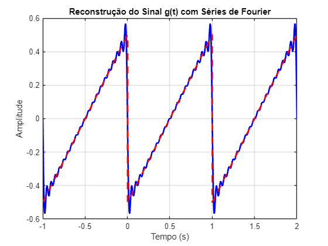

```matlab

% Função 2
% Declarando o número de Harmônicas:
Ni = -20;
Nf = 20;
n = Ni:1:Nf;

To = 1;
w0 = 2 * pi/ To;

tempo = -1 : 1e-3 : 2;  % Define o vetor tempo

% Inicializando o sinal sintetizado
aux2 = 0;

% Realizando a soma da Série de Fourier
for k = 1:41  % Agora usamos o índice k para acessar os valores de n

    aux2 = aux2 + num_dn2(k) * exp(1i * n(k) * w0 * tempo);  % Soma a harmônica ao sinal

end

% Plotando o sinal reconstruído
figure;
plot(tempo, real(aux2), 'r', 'LineWidth', 2);
xlabel('Tempo (s)');
ylabel('Amplitude');
title('Reconstrução do Sinal g(t) com Séries de Fourier');
grid on;
hold on;

% Numericamente o primeiro período:
t2 = 0 : 1e-3 : 1;
g2 = -t2+1/2;

% Numericamente 3 períodos:
t = -1 : 1e-3 : 2;
grafico = plot(t, [g2 g2(2:end) g2(2:end)], 'b');
grafico.LineWidth = 2;
grafico.LineStyle= '--';
grid on;
hold off;
```

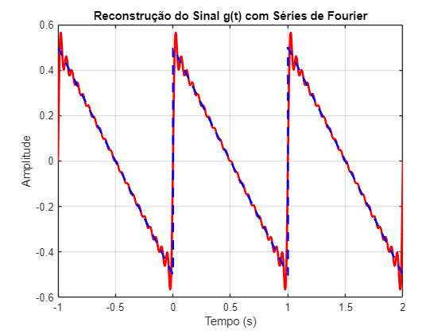

# Síntese da função somando\-as

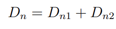

```matlab
Dn = Dn1 + Dn2
```
Dn = 
 $\displaystyle \begin{array}{l} \frac{1}{\sigma_1 }+\frac{\frac{1}{4}+\pi \,n\,{\left(\frac{{\mathrm{e}}^{2\,\pi \,n\,\mathrm{i}} \,\mathrm{i}}{4}+\frac{1}{4}\,\mathrm{i}\right)}-\frac{{\mathrm{e}}^{2\,\pi \,n\,\mathrm{i}} }{4}}{n^2 \,\pi^2 }+\frac{{\left(\sigma_2 -1\right)}\,\mathrm{i}}{4\,n\,\pi }-\frac{\sigma_2 \,{\left(1+2\,\pi \,n\,\mathrm{i}\right)}}{\sigma_1 }\newline \mathrm{}\newline \textrm{where}\newline \mathrm{}\newline \;\;\sigma_1 =4\,n^2 \,\pi^2 \newline \mathrm{}\newline \;\;\sigma_2 ={\mathrm{e}}^{-2\,\pi \,n\,\mathrm{i}}  \end{array}$
 

# Valor numérico de Dn
```matlab
% Número de Dn´s

Ni = -20;
Nf = 20;
n = Ni:1:Nf;

% Para o Dn1

num_dn = eval(Dn);

% Substituindo o not a number, sabendo o D0:
num_dn1(21) = D0_1 + D0_2
```

```matlabTextOutput
num_dn1 = 1x41 complex
   0.0000 - 0.0080i   0.0000 - 0.0084i   0.0000 - 0.0088i  -0.0000 - 0.0094i   0.0000 - 0.0099i   0.0000 - 0.0106i   0.0000 - 0.0114i  -0.0000 - 0.0122i   0.0000 - 0.0133i   0.0000 - 0.0145i   0.0000 - 0.0159i   0.0000 - 0.0177i   0.0000 - 0.0199i   0.0000 - 0.0227i   0.0000 - 0.0265i   0.0000 - 0.0318i   0.0000 - 0.0398i   0.0000 - 0.0531i   0.0000 - 0.0796i   0.0000 - 0.1592i   0.0000 + 0.0000i   0.0000 + 0.1592i   0.0000 + 0.0796i   0.0000 + 0.0531i   0.0000 + 0.0398i   0.0000 + 0.0318i   0.0000 + 0.0265i   0.0000 + 0.0227i   0.0000 + 0.0199i   0.0000 + 0.0177i   0.0000 + 0.0159i   0.0000 + 0.0145i   0.0000 + 0.0133i  -0.0000 + 0.0122i   0.0000 + 0.0114i   0.0000 + 0.0106i   0.0000 + 0.0099i  -0.0000 + 0.0094i   0.0000 + 0.0088i   0.0000 + 0.0084i   0.0000 + 0.0080i

```

*`Pode-se ver que os valores de Dn, Dn1 e Dn2 são iguais, dessa forma existe uma certa igualdade entre elas, caso fazer o plot irá ser possível fazer um triângulo isóceles, única mudança necessária seria alterar o T0 para 2 e consequentemente o W0.`*

# Função de análise(2)

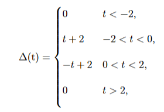

```matlab
% Numericamente o primeiro período:
t1 = -2 : 1e-3 : 0;
g1 = t1+2;

% Numericamente o segundo período:
t2 = 0 : 1e-3 : 2;
g2 = -t2+2;

% Numericamente 3 períodos:
t = -2 : 1e-3 : 6;
plot(t, [g1 g2(2:end) g1(2:end) g2(2:end)], 'b', 'LineWidth', 2);
xlabel('Tempo (s)');
ylabel('Amplitude');
title('Sinal Delta2(t)');
grid on;
```

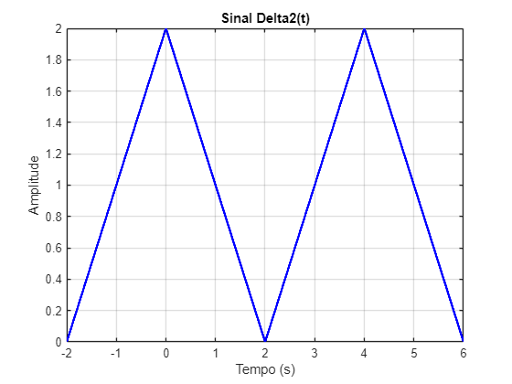

# Cálculo do valor médio

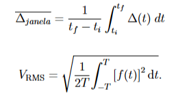


***Para T0 = 4s***

```matlab
% Para o delta 2
% Declaração de variáveis
syms t;
tf1 = -2;
ti1 = 0;
tf2 = 0;
ti2 = 2;

Del_janela_3 = 1/(tf-ti) * int(t+2, t, ti1, tf1);
Del_janela_4 = 1/(tf-ti) * int(-t+2, t, ti2, tf2);
Del_total = Del_janela_3 + Del_janela_4
```
Del_total = 
 $\displaystyle -4$
 

# Cálculo do valor eficaz


***Para T0 = 4s***

```matlab
% Para o f1
% Declaração de variáveis
syms t;
T = 4;

f3 = sqrt(1/(2*T) * int((t+2)^2, t, -T, T));
% Para o f2
% Declaração de variáveis
syms t;
T = 4;

f4 = sqrt(1/(2*T) * int((-t+2)^2, t, -T, T));
f_total = f3 + f4
```
f_total = 
 $\displaystyle \frac{4\,\sqrt{3}\,\sqrt{7}}{3}$
 

# Deslocamento da função g1

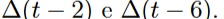


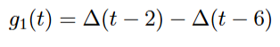

```matlab
% Definindo o vetor de tempo
t = -2 : 1e-3 : 10;

% Inicializando o vetor delta base (∆(t))
delta = zeros(size(t));
delta(t >= -2 & t < 0) = t(t >= -2 & t < 0) + 2;
delta(t >= 0 & t < 2)  = -t(t >= 0 & t < 2) + 2;

% Construindo ∆(t - 2)
delta_t2 = zeros(size(t));
t_aux = t - 2;
delta_t2(t_aux >= -2 & t_aux < 0) = t_aux(t_aux >= -2 & t_aux < 0) + 2;
delta_t2(t_aux >= 0 & t_aux < 2)  = -t_aux(t_aux >= 0 & t_aux < 2) + 2;

% Construindo ∆(t - 6)
delta_t6 = zeros(size(t));
t_aux2 = t - 6;
delta_t6(t_aux2 >= -2 & t_aux2 < 0) = t_aux2(t_aux2 >= -2 & t_aux2 < 0) + 2;
delta_t6(t_aux2 >= 0 & t_aux2 < 2)  = -t_aux2(t_aux2 >= 0 & t_aux2 < 2) + 2;

% g1(t) = ∆(t - 2) - ∆(t - 6)
g1 = delta_t2 - delta_t6;

% --- Plot individual de delta_t2 ---
figure;
plot(t, delta_t2, 'b', 'LineWidth', 2);
xlabel('Tempo (s)');
ylabel('Amplitude');
title('Sinal \Delta(t - 2)');
grid on;
```

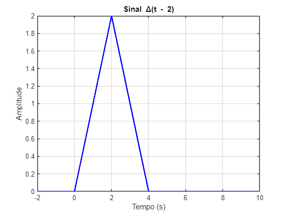

```matlab

% --- Plot individual de delta_t6 ---
figure;
plot(t, delta_t6, 'r', 'LineWidth', 2);
xlabel('Tempo (s)');
ylabel('Amplitude');
title('Sinal \Delta(t - 6)');
grid on;
```

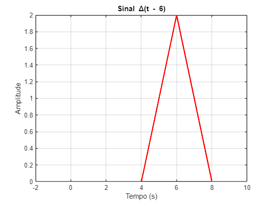

```matlab

% --- Plot geral comparando todos ---
figure;
plot(t, delta_t2, 'b--', 'LineWidth', 1.5); hold on;
plot(t, delta_t6, 'r--', 'LineWidth', 1.5);
plot(t, g1, 'k', 'LineWidth', 2);
legend('\Delta(t - 2)', '\Delta(t - 6)', 'g_1(t)');
xlabel('Tempo (s)');
ylabel('Amplitude');
title('g_1(t) = \Delta(t - 2) - \Delta(t - 6)');
grid on;
```

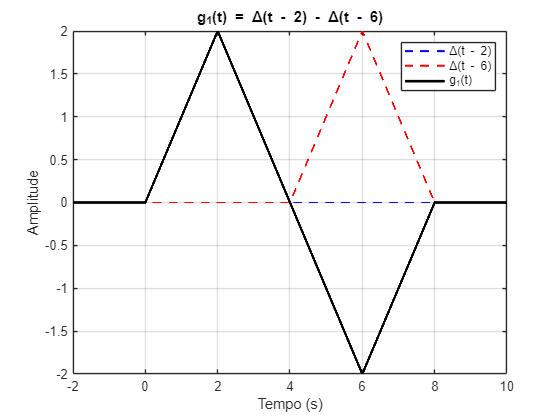

# Calculando valor médio de delta(t \-2)
```matlab
% Para o delta 2
% Declaração de variáveis
syms t;
tf1 = -2;
ti1 = 0;
tf2 = 0;
ti2 = 2;

Del_janela_3 = 1/(tf-ti) * int(t, t, ti1, tf1);
Del_janela_4 = 1/(tf-ti) * int(-t, t, ti2, tf2);
Del_total = Del_janela_3 + Del_janela_4
```
Del_total = 
 $\displaystyle 4$
 

# Calculando valor eficaz de delta(t \-2)
```matlab
% Para o f1
% Declaração de variáveis
syms t;
T = 8;

f3 = sqrt(1/(2*T) * int((t)^2, t, -T, T));
% Para o f2
% Declaração de variáveis
syms t;
T = 8;

f4 = sqrt(1/(2*T) * int((-t)^2, t, -T, T));
f_total1 = f3 + f4
```
f_total1 = 
 $\displaystyle \frac{16\,\sqrt{3}}{3}$
 

```matlab
% Determinando a relação vpico/vrms
r = (f_total1 * sqrt(3))/ f_total1
```
r = 
 $\displaystyle \sqrt{3}$
 

# Calculando valor médio de delta(t \-6)
```matlab
% Para o delta 2
% Declaração de variáveis
syms t;
tf1 = 6;
ti1 = 4;
tf2 = 8;
ti2 = 6;

Del_janela_3 = 1/(tf-ti) * int(t-4, t, ti1, tf1);
Del_janela_4 = 1/(tf-ti) * int(-t+8, t, ti2, tf2);
Del_total = Del_janela_3 + Del_janela_4
```
Del_total = 
 $\displaystyle 4$
 

# Calculando valor eficaz de delta(t \-6)
```matlab
% Para o f1
% Declaração de variáveis
syms t;
T = 8;

f3 = sqrt(1/(2*T) * int((t-4)^2, t, -T, T));
% Para o f2
% Declaração de variáveis
syms t;
T = 8;

f4 = sqrt(1/(2*T) * int((-t+8)^2, t, -T, T));
f_total2 = f3 + f4
```
f_total2 = 
 $\displaystyle \frac{4\,\sqrt{3}\,\sqrt{7}}{3}+\frac{16\,\sqrt{3}}{3}$
 

```matlab
% Determinando a relação vpico/vrms
r = (f_total2 * sqrt(3))/ f_total2
```
r = 
 $\displaystyle \sqrt{3}$
 

# Deslocamento da função g2
```matlab
% --- Definindo vetor de tempo
t = -2 : 1e-3 : 10;

% --- Criando função base delta (∆(t))
delta = zeros(size(t));
delta(t >= -2 & t < 0) = t(t >= -2 & t < 0) + 2;
delta(t >= 0 & t < 2)  = -t(t >= 0 & t < 2) + 2;

% --- ∆(t - 2)
delta_t2 = zeros(size(t));
t_aux2 = t - 2;
delta_t2(t_aux2 >= -2 & t_aux2 < 0) = t_aux2(t_aux2 >= -2 & t_aux2 < 0) + 2;
delta_t2(t_aux2 >= 0 & t_aux2 < 2)  = -t_aux2(t_aux2 >= 0 & t_aux2 < 2) + 2;

% --- ∆(t - 4)
delta_t4 = zeros(size(t));
t_aux4 = t - 4;
delta_t4(t_aux4 >= -2 & t_aux4 < 0) = t_aux4(t_aux4 >= -2 & t_aux4 < 0) + 2;
delta_t4(t_aux4 >= 0 & t_aux4 < 2)  = -t_aux4(t_aux4 >= 0 & t_aux4 < 2) + 2;

% --- g2(t) = ∆(t - 2) - ∆(t - 4)
g2 = delta_t2 - delta_t4;

% --- Plot individual ∆(t-2)
figure;
plot(t, delta_t2, 'b', 'LineWidth', 2);
xlabel('Tempo (s)');
ylabel('Amplitude');
title('\Delta(t - 2)');
grid on;
```

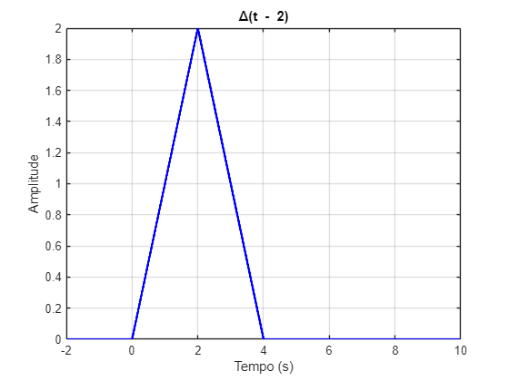

```matlab

% --- Plot individual ∆(t-4)
figure;
plot(t, delta_t4, 'r', 'LineWidth', 2);
xlabel('Tempo (s)');
ylabel('Amplitude');
title('\Delta(t - 4)');
grid on;
```

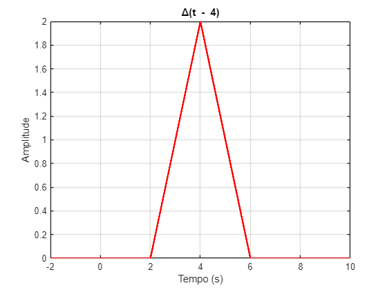

```matlab

% --- Plot geral g2(t)
figure;
plot(t, delta_t2, 'b--', 'LineWidth', 1.5); hold on;
plot(t, delta_t4, 'r--', 'LineWidth', 1.5);
plot(t, g2, 'k', 'LineWidth', 2);
legend('\Delta(t - 2)', '\Delta(t - 4)', 'g_2(t)');
xlabel('Tempo (s)');
ylabel('Amplitude');
title('g_2(t) = \Delta(t - 2) - \Delta(t - 4)');
grid on;
```

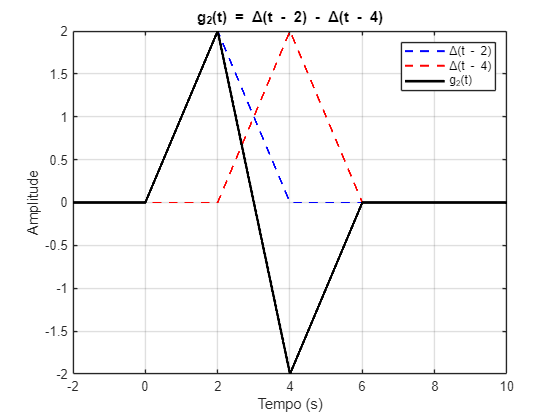


# Calculando valor médio de delta(t \-2)
```matlab
syms t;
Del1 = 1/4 * int(t+2, t, 0, 2);
Del2 = 1/4 * int(-t+2, t, 2, 4);
Vm_delta2 = Del1 + Del2;
```

# Calculando valor eficaz de delta(t \-2)
```matlab
Vrms1 = sqrt(1/4 * int((t+2)^2, t, 0, 2));
Vrms2 = sqrt(1/4 * int((-t+2)^2, t, 2, 4));
Vrms_delta2 = Vrms1 + Vrms2;
```

# Calculando valor médio de delta(t \-4)
```matlab
Del3 = 1/4 * int(t-2, t, 2, 4);
Del4 = 1/4 * int(-t+6, t, 4, 6);
Vm_delta4 = Del3 + Del4;
```

# Calculando valor eficaz de delta(t \-4)
```matlab
Vrms3 = sqrt(1/4 * int((t-2)^2, t, 2, 4));
Vrms4 = sqrt(1/4 * int((-t+6)^2, t, 4, 6));
Vrms_delta4 = Vrms3 + Vrms4;
```

# Corelação Cruzada
```matlab
% Vetor de tempo
t = -2 : 1e-3 : 10;

% Construindo ∆(t - 2)
delta_t2 = zeros(size(t));
t_aux2 = t - 2;
delta_t2(t_aux2 >= -2 & t_aux2 < 0) = t_aux2(t_aux2 >= -2 & t_aux2 < 0) + 2;
delta_t2(t_aux2 >= 0 & t_aux2 < 2)  = -t_aux2(t_aux2 >= 0 & t_aux2 < 2) + 2;

% Construindo ∆(t - 4)
delta_t4 = zeros(size(t));
t_aux4 = t - 4;
delta_t4(t_aux4 >= -2 & t_aux4 < 0) = t_aux4(t_aux4 >= -2 & t_aux4 < 0) + 2;
delta_t4(t_aux4 >= 0 & t_aux4 < 2)  = -t_aux4(t_aux4 >= 0 & t_aux4 < 2) + 2;

% Construindo ∆(t - 6)
delta_t6 = zeros(size(t));
t_aux6 = t - 6;
delta_t6(t_aux6 >= -2 & t_aux6 < 0) = t_aux6(t_aux6 >= -2 & t_aux6 < 0) + 2;
delta_t6(t_aux6 >= 0 & t_aux6 < 2)  = -t_aux6(t_aux6 >= 0 & t_aux6 < 2) + 2;

% --- Correlação cruzada (f ⋆ g)(τ)
taus = 0 : 1e-3 : 4;  % deslocamento τ de 0 a 4
corr_2_6 = zeros(size(taus));
corr_2_4 = zeros(size(taus));

for i = 1:length(taus)
    tau = taus(i);

    % f(t) = delta_t2
    % g(t + τ) => deslocar delta_t6 e delta_t4 para esquerda: g(t+τ) == g_shift(t)
    delta_t6_shift = zeros(size(t));
    delta_t4_shift = zeros(size(t));
    
    t_shift6 = t + tau - 6;
    t_shift4 = t + tau - 4;

    delta_t6_shift(t_shift6 >= -2 & t_shift6 < 0) = t_shift6(t_shift6 >= -2 & t_shift6 < 0) + 2;
    delta_t6_shift(t_shift6 >= 0 & t_shift6 < 2)  = -t_shift6(t_shift6 >= 0 & t_shift6 < 2) + 2;

    delta_t4_shift(t_shift4 >= -2 & t_shift4 < 0) = t_shift4(t_shift4 >= -2 & t_shift4 < 0) + 2;
    delta_t4_shift(t_shift4 >= 0 & t_shift4 < 2)  = -t_shift4(t_shift4 >= 0 & t_shift4 < 2) + 2;

    % Correlação cruzada numérica com produto ponto a ponto
    corr_2_6(i) = trapz(t, delta_t2 .* delta_t6_shift);
    corr_2_4(i) = trapz(t, delta_t2 .* delta_t4_shift);
end

% --- Plot dos resultados
figure;
plot(taus, corr_2_6, 'r', 'LineWidth', 2); hold on;
plot(taus, corr_2_4, 'b', 'LineWidth', 2);
xlabel('\tau');
ylabel('Correlação cruzada');
legend('\Delta(t-2) ⋆ \Delta(t-6)', '\Delta(t-2) ⋆ \Delta(t-4)');
title('Correlação cruzada dos sinais em função de \tau');
grid on;
```

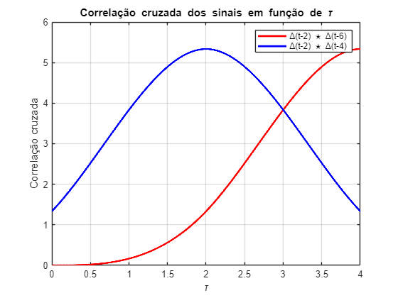

# Potência do sinal g(t) em função de a
```matlab

syms t a real

% Período do sinal
T0 = 20;

% Definindo a função g(t)
g_t = piecewise(t < 0, 0, ...
                0 <= t & t < 10, 1 - exp(-a*t), ...
                10 <= t & t < 20, exp(-a*t + a*10), ...
                t >= 20, 0);

% Calculando potência Pg(a)
Pg = (1/T0) * int(g_t^2, t, 0, T0);
Pg_simplified = simplify(Pg);

% Plotando Pg(a)
fplot(matlabFunction(Pg_simplified), [0.01, 5]);
xlabel('a');
ylabel('Potência Pg');
title('Potência do sinal g(t) em função de a');
grid on;
```

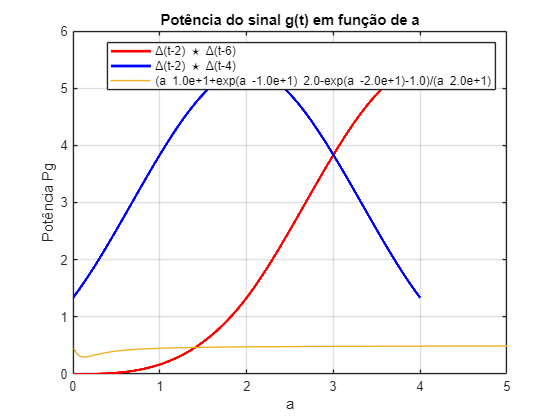

# Coeficientes Dn da Série de Fourier para a = 2
```matlab

a_val = 2;
T0 = 20;
w0 = 2*pi/T0;
syms t n real

% Substituir a = 2 no g(t)
g_t2 = subs(g_t, a, a_val);

% Dn = 1/T0 * ∫ g(t) * exp(-j*n*w0*t) dt
Dn = (1/T0) * int(g_t2 * exp(-1i*n*w0*t), t, 0, T0);
Dn_simplified = simplify(Dn);

% Gerar função anônima para Dn(n)
Dn_func = matlabFunction(Dn_simplified, 'Vars', n);

```

# Determinar N tal que potência acumulada seja 95% da original
```matlab

% Calculando potência total para a=2
Pg2 = double(subs(Pg_simplified, a, a_val));

% Loop para acumular potência dos |Dn|^2
N_max = 100; % Limite superior razoável
Dn_vals = arrayfun(Dn_func, -N_max:N_max);
Dn_power = abs(Dn_vals).^2;

% Acumulando potência parcial
P_acumulada = 0;
for N = 1:N_max
    P_N = sum(Dn_power(N_max+1-N : N_max+1+N));
    if P_N >= 0.95 * Pg2
        break;
    end
end

% Mostrar resultados
fprintf('Potência total Pg = %.4f\\n', Pg2);
```

```matlabTextOutput
Potência total Pg = 0.4750\n
```

```matlab
fprintf('Valor de N para atingir 95%% da potência: N = %d\\n', N);
```

```matlabTextOutput
Valor de N para atingir 95% da potência: N = 100\n
```

```matlab
fprintf('Frequência máxima (banda) = %.4f Hz\\n', N * w0 / (2*pi));
```

```matlabTextOutput
Frequência máxima (banda) = 5.0000 Hz\n
```

# Comparação dos sinais
```matlab
% Sinal original e sinal reconstruído com N termos
t_vals = linspace(0, T0, 1000);
g_vals = double(subs(g_t2, t, t_vals));

% Reconstrução do sinal com N termos
gs = zeros(size(t_vals));
for k = -N:N
    gs = gs + Dn_func(k) * exp(1i * k * w0 * t_vals);
end
gs_real = real(gs);

% Plot
figure;
plot(t_vals, g_vals, 'b', 'LineWidth', 2); hold on;
plot(t_vals, gs_real, 'r--', 'LineWidth', 2);
legend('g(t)', 'g_s(t)');
xlabel('Tempo (s)');
ylabel('Amplitude');
title(sprintf('Comparação entre g(t) e g_s(t) com N = %d termos', N));
grid on;
```

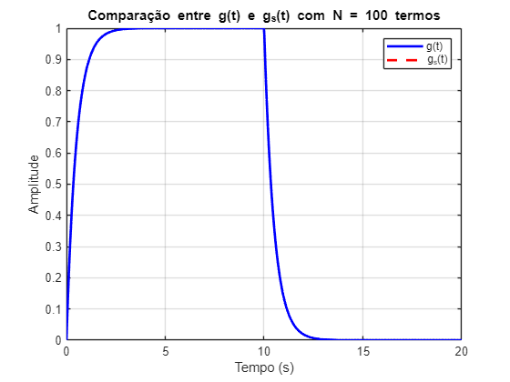

# Sinal ∆(t) e sua derivada q(t)
```matlab
clear; clc;
t = -2:1e-3:2;  % intervalo de tempo
T0 = 2;         % período

% Sinal triangular ∆(t)
delta = zeros(size(t));
delta(t >= -1 & t < 0) = t(t >= -1 & t < 0) + 1;
delta(t >= 0 & t < 1) = -t(t >= 0 & t < 1) + 1;

% Derivada numérica
dt = t(2) - t(1);
q = diff(delta) / dt;
t_q = t(1:end-1);

% Plot ∆(t) e q(t)
figure;
subplot(2,1,1);
plot(t, delta, 'b', 'LineWidth', 2);
title('∆(t) - Pulso Triangular');
xlabel('Tempo'); ylabel('Amplitude'); grid on;

subplot(2,1,2);
plot(t_q, q, 'r', 'LineWidth', 2);
title('q(t) = d∆(t)/dt');
xlabel('Tempo'); ylabel('Amplitude'); grid on;
```

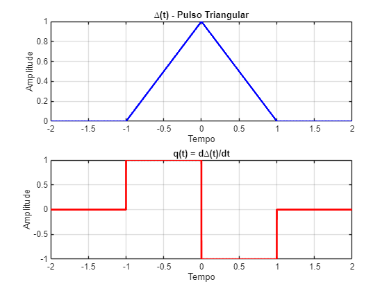

# Coeficientes Dn da série de Fourier de ∆(t)
```matlab
syms t_sym n real
w0 = 2*pi/T0;

% ∆(t) simbólico
delta_sym = piecewise(t_sym < -1, 0, ...
                      -1 <= t_sym & t_sym < 0, t_sym + 1, ...
                       0 <= t_sym & t_sym < 1, -t_sym + 1, ...
                       t_sym >= 1, 0);

% Cálculo do coeficiente Dn
Dn = (1/T0) * int(delta_sym * exp(-1i*n*w0*t_sym), t_sym, -1, 1);
Dn = simplify(Dn);

% Função anônima numérica de Dn(n)
Dn_func = matlabFunction(Dn, 'Vars', n);

```

# Síntese com Dnmod = jn\*w0\*Dn
```matlab
N = 20;
t_vals = -2:1e-3:2;
sinal_q1 = zeros(size(t_vals));

for k = -N:N
    Dn_mod = 1i * k * w0 * Dn_func(k);
    sinal_q1 = sinal_q1 + Dn_mod * exp(1i * k * w0 * t_vals);
end

% Plot comparativo
figure;
plot(t_q, q, 'r', 'LineWidth', 2); hold on;
plot(t_vals, real(sinal_q1), 'b--', 'LineWidth', 2);
legend('Derivada Real q(t)', 'Síntese com Dnmod = jn\omega_0 Dn');
title('Comparação com Dnmod = jnω₀Dn'); grid on;
```

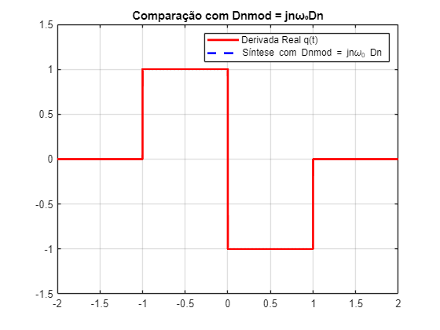

# Síntese com Dnmod = \-n²\*w0²\*Dn
```matlab
N = 40;
sinal_q2 = zeros(size(t_vals));

for k = -N:N
    if k == 0
        continue; % Ignora k=0 para evitar n^2*D0 = 0
    end
    Dn_mod = - (k^2) * w0^2 * Dn_func(k);
    sinal_q2 = sinal_q2 + Dn_mod * exp(1i * k * w0 * t_vals);
end

% Plot
figure;
plot(t_vals, real(sinal_q2), 'm', 'LineWidth', 2);
title('Síntese com Dnmod = -n^2ω₀^2Dn');
xlabel('Tempo'); ylabel('Amplitude');
grid on;
```

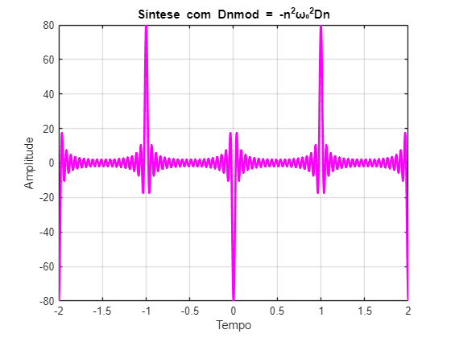


# Síntese com Dnmod = Dn / (jn\*w0)
```matlab
sinal_q3 = zeros(size(t_vals));

for k = -N:N
    if k == 0
        continue;  % evitar divisão por zero
    end
    Dn_mod = Dn_func(k) / (1i * k * w0);
    sinal_q3 = sinal_q3 + Dn_mod * exp(1i * k * w0 * t_vals);
end

% Plot
figure;
plot(t_vals, real(sinal_q3), 'g', 'LineWidth', 2);
title('Síntese com Dnmod = Dn / (jnω₀)');
xlabel('Tempo'); ylabel('Amplitude');
grid on;
```

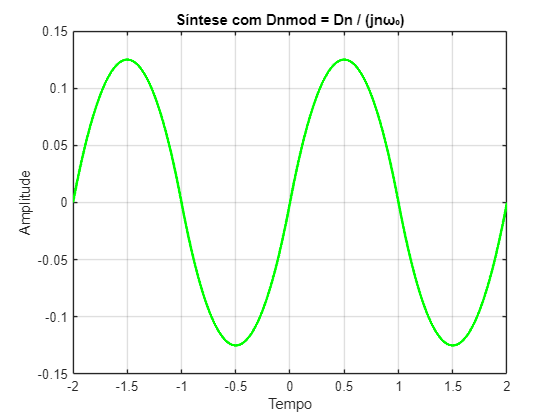
