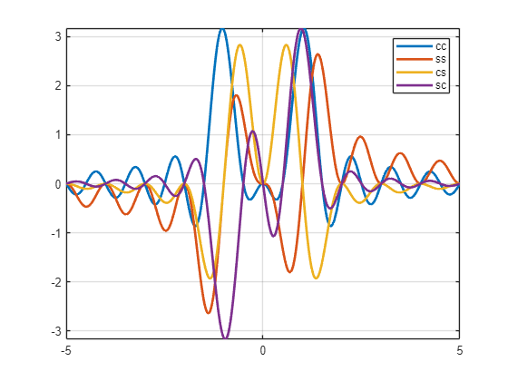
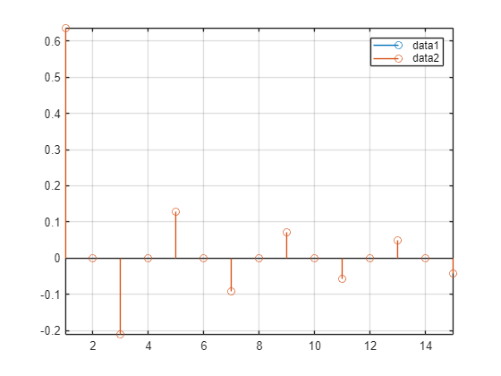
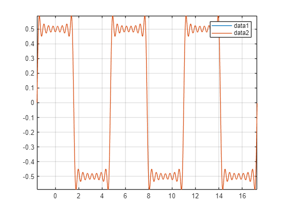

# Análise de Fourier
<a name="beginToc"></a>

## Tópicos
&emsp;[Boas práticas](#boas-práticas)
 
&emsp;[Analisando n](#analisando-n)
 
&emsp;[Aplicar essa proposta para decompor um sinal](#aplicar-essa-proposta-para-decompor-um-sinal)
 
&emsp;[Substituindo valores](#substituindo-valores)
 
&emsp;[Sitntetizando o sinal g(t)](#sitntetizando-o-sinal-g-t-)
 
&emsp;[Análise de Fourier](#análise-de-fourier)
 
&emsp;[Sintese de Fourier](#sintese-de-fourier)
 
&emsp;[Série exponencial \- análise](#série-exponencial-análise)
 
&emsp;[Sintese de Fourier](#sintese-de-fourier)
 
<a name="endToc"></a>

# Boas práticas
```matlab
clear;
close all;
clc;
%% finaliza tudo que tinha antes

```

# Analisando n
```matlab
syms t n
Num_cc = int(cos(t) * cos(n*t), t, 0, 2*pi);
Num_ss = int(sin(t) * sin(n*t), t, 0, 2*pi);
Num_sc = int(sin(t) * cos(n*t), t, 0, 2*pi);
Num_cs = int(cos(t) * sin(n*t), t, 0, 2*pi);
fplot(n, Num_cc, 'LineWidth', 2) % Plot da função acima
hold
```

```matlabTextOutput
Current plot held
```

```matlab
fplot(n, Num_cs, 'LineWidth', 2)
fplot(n, Num_sc, 'LineWidth', 2)
fplot(n, Num_ss, 'LineWidth', 2)
legend('cc', 'ss', 'cs', 'sc')
grid
hold off;
```



```matlab
% Podemos analisar a função e ver em quais pontos de n a integral será "0"
```

# Aplicar essa proposta para decompor um sinal
```matlab
syms  n t Ap An t0 T

Num_cnc = int(Ap * cos(n*t), t, t0, t0+T/2) + int(An * cos(n*t), t, t0+T/2, t0+T);
Den_cnc = int(cos(n*t) * cos(n*t), t, 0, T);

Num_cns = int(Ap * cos(n*t), t, t0, t0+T/2) + int(An * cos(n*t), t, t0+T/2, t0+T);
Den_cns = int(cos(n*t) * cos(n*t), t, 0, T);
```

# Substituindo valores
```matlab
Ap = +0.5;
An = -0.5;
t0 = -pi/2;
T = 2*pi;
N = 15;
n = 1 : 1 : N;

cla;
cnc = eval(Num_cnc)./eval(Den_cnc);
cns = eval(Num_cns)./eval(Den_cns);
hold;
```

```matlabTextOutput
Current plot held
```

```matlab
stem(cns);
stem(cnc);
hold off;
```



# Sitntetizando o sinal g(t)
```matlab
tempo = t0 : 1e-3 : t0+3*T;

auxvar =  0;

for k = 1 : N 
    auxvar = auxvar + cns(k) * cos(n(k) * tempo);
end

cla;
gt = auxvar;
hold;
```

```matlabTextOutput
Current plot held
```

```matlab
plot(tempo, gt);

auxvar =  0;

for k = 1 : N 
    auxvar = auxvar + cnc(k) * cos(n(k) * tempo);
end

gt = auxvar;
plot(tempo, gt);
hold off;
```



# Análise de Fourier
 $$ a_n =\frac{2}{T_0 }\int_{T_0 } g(t)cos(n\omega_0 t)dt $$ 

 $$ b_n =\frac{2}{T_0 }\int_{T_0 } g(t)sin(n\omega_0 t)dt $$ 

 $$ a_0 =\frac{1}{T_0 }\int_{T_0 } g(t)dt $$ 


# Sintese de Fourier
 $$ g(t)=a_0 +\sum_{n=1}^{\infty } a_n cos(\omega_0 t)+b_n sin(n\omega_0 t) $$ 


# Série exponencial \- análise
 $$ D_n =\frac{1}{T_0 }\int_{T_0 } g(t)e^{-jn\omega_0 t} dt $$ 


# Sintese de Fourier
 $$ g(t)=\sum_{n=-\infty }^{n=+\infty } D_n e^{jn\omega_0 t} $$ 


**Pensando na fórmula de Euler**

 $$ e^{jx} =cos(x)+j\;sin(x) $$ 

 $$ e^{-jx} =cos(x)-j\;sin(x) $$ 

 $$ e^{jx} +e^{-jx} =2cos(x) $$ 

 $$ e^{jx} -e^{-jx} =2j\;sin(x) $$ 
