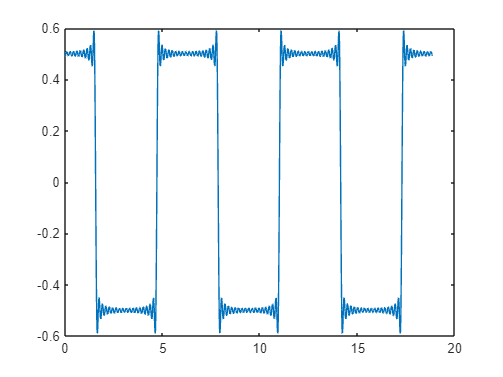

# Aula\_02\_ECM307 \- Analogia entre vetores e sinais
<a name="beginToc"></a>

## Conteúdo        
&emsp;[Boas práticas](#boas-práticas)
 
&emsp;[Cálculo simbólico](#cálculo-simbólico)
 
&emsp;[Substituindo os valores](#substituindo-os-valores)
 
&emsp;[Somando as hamônicas](#somando-as-hamônicas)
 
<a name="endToc"></a>

# Boas práticas
```matlab
clear;
close all;
clc;
```

# Cálculo simbólico
```matlab
syms Ap An n t

num = int(Ap*cos(n*t),t,-pi/2,pi/2) + int(An*cos(n*t),t,pi/2,3*pi/2)
```
num = 
 $\displaystyle \frac{2\,\textrm{Ap}\,\sin \left(\frac{\pi \,n}{2}\right)}{n}-\frac{\textrm{An}\,{\left(\sin \left(\frac{\pi \,n}{2}\right)-\sin \left(\frac{3\,\pi \,n}{2}\right)\right)}}{n}$
 

```matlab
den = int(cos(n*t)^2,t,0,2*pi)
```
den = 
 $\displaystyle \pi +\frac{\sin \left(4\,\pi \,n\right)}{4\,n}$
 

# Substituindo os valores
```matlab
N  = 36;
n  = 1:1:N;
Ap = +1/2;
An = -1/2;

Num_numerico = eval(num);
Den_numerico = eval(den);

c = Num_numerico./Den_numerico
```

```matlabTextOutput
c = 1x36
    0.6366    0.0000   -0.2122   -0.0000    0.1273         0   -0.0909   -0.0000    0.0707   -0.0000   -0.0579         0    0.0490    0.0000   -0.0424   -0.0000    0.0374   -0.0000   -0.0335    0.0000    0.0303    0.0000   -0.0277         0    0.0255   -0.0000   -0.0236   -0.0000    0.0220    0.0000   -0.0205   -0.0000    0.0193   -0.0000   -0.0182    0.0000

```

# Somando as hamônicas
```matlab
aux   = 0
```

```matlabTextOutput
aux = 0
```

```matlab
tempo = [0:1e-3:6*pi];

for k = 1:N

    aux  =  aux + c(k)*cos(n(k)*tempo);

end

plot(tempo,aux)
```




