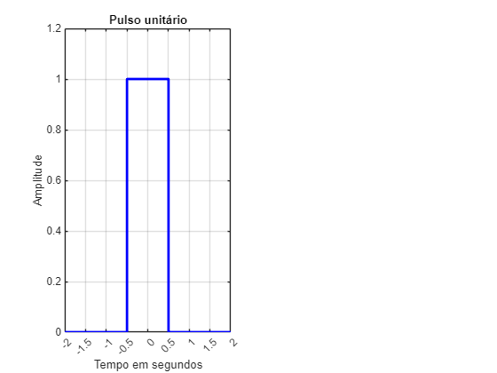
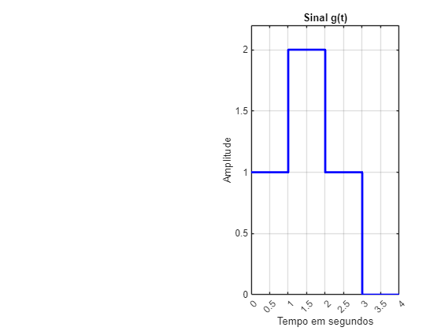
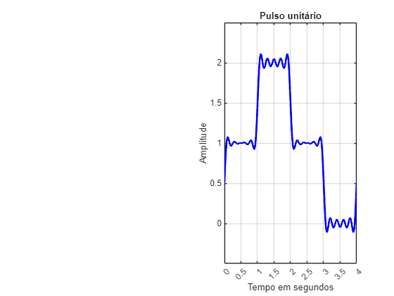

# Aula\_03\_ECM307 \- Série Trigonométrica de Fourier

Felipe Fazio da Costa; RA: 23.00055\-4

<a name="beginToc"></a>

## Conteúdo
&emsp;[Boas práticas](#boas-práticas)
 
&emsp;[Função p(t)](#função-p-t-)
 
&emsp;[Calculando an](#calculando-an)
 
&emsp;[Calculando bn](#calculando-bn)
 
&emsp;[Calculando a0](#calculando-a0)
 
&emsp;[Valor numérico de an e bn:](#valor-numérico-de-an-e-bn-)
 
&emsp;[Calculando a função sintetizada para p(t)](#calculando-a-função-sintetizada-para-p-t-)
 
&emsp;[Boas práticas](#boas-práticas)
 
&emsp;[Função g(t)](#função-g-t-)
 
&emsp;[Calculando an](#calculando-an)
 
&emsp;[Calculando bn](#calculando-bn)
 
&emsp;[Calculando a0](#calculando-a0)
 
&emsp;[Valor numérico de an e bn:](#valor-numérico-de-an-e-bn-)
 
&emsp;[Calculando a função sintetizada para p(t)](#calculando-a-função-sintetizada-para-p-t-)
 
&emsp;[Conclusão](#conclusão)
 
<a name="endToc"></a>

# Boas práticas
```matlab
clear;
close all;
clc;
%%% Limpando todo sistema para início dos calculos
```

# Função p(t)
```matlab
t1 = [-2 -0.5 -0.5 0.5 0.5 2]; % Eixos de tempo
x1 = [0 0 1 1 0 0]; % Amplitude
% Criando a figura
figure;

% Primeiro gráfico (Pulso unitário)
subplot(1,2,1);
plot(t1, x1, 'b', 'LineWidth', 2);
grid on;
axis([-2 2 0 1.2]);
xlabel('Tempo em segundos');
ylabel('Amplitude');
title('Pulso unitário');
% Ajustar ticks no eixo X e Y do primeiro gráfico
xticks(-2:0.5:2); % Marcações no eixo X de -2 até 2 com passo de 0.5
yticks(0:0.2:1.2); % Marcações no eixo Y de 0 até 1.2 com passo de 0.2
```



# Calculando an


```matlab
syms n t; % inicialização das variávieis
To = 4; % definindo o valor do período
w = (2 * pi)/To; % defininido w pela fórmula (2*pi)/To

% Calculando an, somente para f(t) = 1, pois o outro valor que adota é 0
an = 2/To * int(1 * cos(n * w * t), t, -0.5, 0.5)
```
an = 
 $\displaystyle \frac{2\,\sin \left(\frac{\pi \,n}{4}\right)}{n\,\pi }$
 

# Calculando bn


```matlab
syms n t; % inicialização das variávieis
To = 4; % definindo o valor do período
w = (2 * pi)/To; % defininido w pela fórmula (2*pi)/To

% Calculando bn, somente para p(t) = 1, pois o outro valor que adota é 0
bn = 2/To * int(1 * sin(n * w * t), t, -0.5, 0.5)
```
bn = 
 $\displaystyle 0$
 

```matlab
bn;
```

# Calculando a0


```matlab
syms t; % inicialização das variávieis

% Calculando bn, somente para p(t) = 1, pois o outro valor que adota é 0
a0 = 1/To * int(1 , t, -0.5, 0.5)
```
a0 = 
 $\displaystyle \frac{1}{4}$
 

# Valor numérico de an e bn:
```matlab
%% Calculando an
num_an = eval(an)
```
num_an = 
 $\displaystyle \frac{2\,\sin \left(\frac{\pi \,n}{4}\right)}{n\,\pi }$
 

# Calculando a função sintetizada para p(t)


```matlab
%%% Declarando o número de Harmônicas:
N = 20;
n = 1:1:N;

num_plot_an = eval(num_an);

tempo = -2 : 1e-3 : 2;  % Define o vetor tempo

aux = a0;
% Obtenção do sinal sintetizado
for k = 1:N

    aux  =  aux + num_plot_an(k)*cos(n(k)*w*tempo);
end

gt0_sintetizado = aux;
plot(tempo, gt0_sintetizado,'b', 'LineWidth', 2)

grid on;
xlabel('Tempo em segundos');
ylabel('Amplitude');
title('Pulso unitário');

% Ajustar ticks no eixo X e Y do primeiro gráfico
xticks(-2:0.5:2); % Marcações no eixo X de -2 até 2 com passo de 0.5
yticks(0:0.2:1.2); % Marcações no eixo Y de 0 até 1.2 com passo de 0.2
hold off;
```


# Boas práticas
```matlab
clear;
close all;
clc;
%%% Limpando todo sistema para início dos calculos
```

# Função g(t)
```matlab
% Definição do segundo sinal: g(t)
t2 = [0 1 1 2 2 3 3 4]; % Eixos de tempo
x2 = [1 1 2 2 1 1 0 0]; % Amplitude

% Segundo gráfico (Sinal g(t))
subplot(1,2,2);
plot(t2, x2, 'b', 'LineWidth', 2); % Preto para manter padrão
grid on;
axis([0 4 0 2.2]);
xlabel('Tempo em segundos');
ylabel('Amplitude');
title('Sinal g(t)');
% Ajustar ticks no eixo X e Y do segundo gráfico
xticks(0:0.5:4); % Marcações no eixo X de 0 até 4 com passo de 0.5
yticks(0:0.5:2.2); % Marcações no eixo Y de 0 até 2.2 com passo de 0.5
```



# Calculando an


```matlab
syms n t; % inicialização das variávieis
To = 4; % definindo o valor do período
w = (2 * pi)/To; % defininido w pela fórmula (2*pi)/To

% Calculando an, somente para f(t) = 1 e f(t) = 2, pois o outro valor que adota é 0
an = 2/To * (int(1 * cos(n * w * t), t, 0, 1) + int(2 * cos(n * w * t), t, 1, 2) + int(1 * cos(n * w * t), t, 2, 3))
```
an = 
 $\displaystyle \frac{\sin \left(\frac{\pi \,n}{2}\right)}{n\,\pi }+\frac{2\,{\left(\sin \left(\pi \,n\right)-\sin \left(\frac{\pi \,n}{2}\right)\right)}}{n\,\pi }-\frac{\sin \left(\pi \,n\right)-\sin \left(\frac{3\,\pi \,n}{2}\right)}{n\,\pi }$
 

# Calculando bn


```matlab
syms n t; % inicialização das variávieis
To = 4; % definindo o valor do período
w = (2 * pi)/To; % defininido w pela fórmula (2*pi)/To

% Calculando an, somente para f(t) = 1 e f(t) = 2, pois o outro valor que adota é 0
bn = 2/To * (int(1 * sin(n * w * t), t, 0, 1) + int(2 * sin(n * w * t), t, 1, 2) + int(1 * sin(n * w * t), t, 2, 3))
```
bn = 
 $\displaystyle \frac{\cos \left(\pi \,n\right)-\cos \left(\frac{3\,\pi \,n}{2}\right)}{n\,\pi }-\frac{2\,{\left(\cos \left(\pi \,n\right)-\cos \left(\frac{\pi \,n}{2}\right)\right)}}{n\,\pi }+\frac{2\,{\sin \left(\frac{\pi \,n}{4}\right)}^2 }{n\,\pi }$
 

# Calculando a0


```matlab
syms t; % inicialização das variávieis

% Calculando bn, somente para p(t) = 1, pois o outro valor que adota é 0
a0 = 1/To * (int(1 , t, 0, 1) + int(2 , t, 1, 2) + int(1 , t, 2, 3))
```
a0 = 
 $\displaystyle 1$
 

# Valor numérico de an e bn:
```matlab
%% Calculando an
num_an = eval(an)
```
num_an = 
 $\displaystyle \frac{2\,\sin \left(\pi \,n\right)-2\,\sin \left(\frac{\pi \,n}{2}\right)}{n\,\pi }+\frac{\sin \left(\frac{\pi \,n}{2}\right)}{n\,\pi }-\frac{\sin \left(\pi \,n\right)-\sin \left(\frac{3\,\pi \,n}{2}\right)}{n\,\pi }$
 

```matlab

%% Calculando an
num_bn = eval(bn)
```
num_bn = 
 $\displaystyle \frac{\cos \left(\pi \,n\right)-\cos \left(\frac{3\,\pi \,n}{2}\right)}{n\,\pi }+\frac{2\,{\sin \left(\frac{\pi \,n}{4}\right)}^2 }{n\,\pi }-\frac{2\,\cos \left(\pi \,n\right)-2\,\cos \left(\frac{\pi \,n}{2}\right)}{n\,\pi }$
 

# Calculando a função sintetizada para p(t)


```matlab
%%% Declarando o número de Harmônicas:
N = 20;
n = 1:1:N;

num_plot_an = eval(num_an);
num_plot_bn = eval(num_bn);

tempo = 0 : 1e-3 : 4;  % Define o vetor tempo

aux = a0;
% Obtenção do sinal sintetizado
for k = 1:N

    aux  =  aux + num_plot_an(k)*cos(n(k)*w*tempo) + num_plot_bn(k)*sin(n(k)*w*tempo);
end

gt0_sintetizado = aux;
plot(tempo, gt0_sintetizado,'b', 'LineWidth', 2)

grid on;
xlabel('Tempo em segundos');
ylabel('Amplitude');
title('Pulso unitário');

% Ajustar ticks no eixo X e Y do segundo gráfico
xticks(0:0.5:4); % Marcações no eixo X de 0 até 4 com passo de 0.5
yticks(0:0.5:2.2); % Marcações no eixo Y de 0 até 2.2 com passo de 0.5
```



# Conclusão
-  No domínio de Fourier, um **pulso retangular** se transforma em uma **função sinc**,o que mostra que o sinal possui uma distribuição espectral larga. 
-  O sinal g(t), que é formado por soma e deslocamento de p(t), resultará em um espectro modificado pela superposição das versões deslocadas da transformada sinc. 
-  Se g(t) for uma convolução de p(t) com outro sinal, então o resultado em Fourier será o **produto** das transformadas. 

Portanto, a relação entre p(t) e g(t) no domínio do tempo pode ser observada no domínio de Fourier como uma **modificação espectral devido a deslocamentos, somas e convoluções**, dependendo de como g(t) é construído a partir de p(t).

