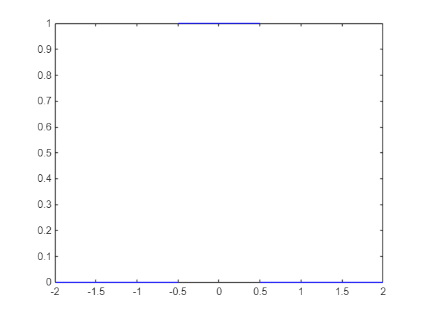
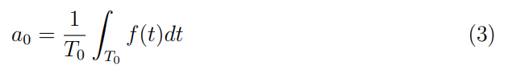
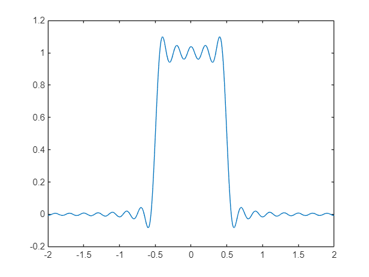
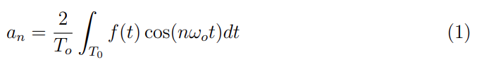
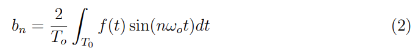
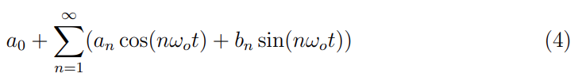
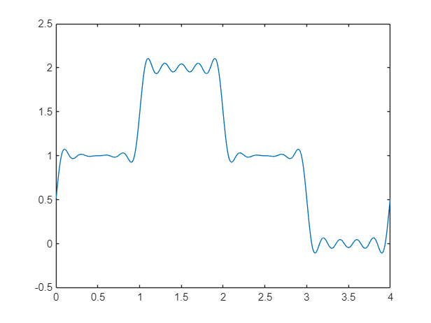

# Aula\_03\_ECM307 \- Série Trigonométrica de Fourier

Felipe Fazio da Costa; RA: 23.00055\-4

<a name="beginToc"></a>

## Conteúdo
&emsp;[Boas práticas](#boas-práticas)
 
&emsp;[Função p(t)](#função-p-t-)
 
&emsp;[Calculando an](#calculando-an)
 
&emsp;[Calculando bn](#calculando-bn)
 
&emsp;[Calculando a0](#calculando-a0)
 
&emsp;[Valor numérico de an e bn:](#valor-numérico-de-an-e-bn-)
 
&emsp;[Calculando a função sintetizada para p(t)](#calculando-a-função-sintetizada-para-p-t-)
 
&emsp;[Função g(t)](#função-g-t-)
 
&emsp;[Calculando an](#calculando-an)
 
&emsp;[Calculando bn](#calculando-bn)
 
&emsp;[Calculando a0](#calculando-a0)
 
&emsp;[Valor numérico de an e bn:](#valor-numérico-de-an-e-bn-)
 
&emsp;[Calculando a função sintetizada para p(t)](#calculando-a-função-sintetizada-para-p-t-)
 
<a name="endToc"></a>

# Boas práticas
```matlab
clear;
close all;
clc;
%%% Limpando todo sistema para início dos calculos
```

# Função p(t)
```matlab
%%% Primeiro período
t1 = -2 : 1e-3 : -0.5;
g1 = zeros(size(t1));  % g1 é 0 para t1

t2 = -0.5 : 1e-3 : 0.5;
g2 = ones(size(t2));  % g2 é 1 para t2

t3 = 0.5 : 1e-3 : 2;
g3 = zeros(size(t3));  % g2 é 1 para t2

%%% Plotagem
plot(t1, g1, 'b');  % Plota o primeiro intervalo em azul
hold on;  % Mantém o gráfico atual
plot(t2, g2, 'b');  % Plota o segundo intervalo em azul
plot(t3, g3, 'b');  % Plota o segundo intervalo em azul

hold off;  % Libera o gráfico para novas plotagens
```




# Calculando an


```matlab
syms n t; % inicialização das variávieis
To = 4; % definindo o valor do período
w = (2 * pi)/To; % defininido w pela fórmula (2*pi)/To

% Calculando an, somente para f(t) = 1, pois o outro valor que adota é 0
an = 2/To * int(1 * cos(n * w * t), t, -0.5, 0.5)
```
an = 
 $\displaystyle \frac{2\,\sin \left(\frac{\pi \,n}{4}\right)}{n\,\pi }$
 

# Calculando bn


```matlab
syms n t; % inicialização das variávieis
To = 4; % definindo o valor do período
w = (2 * pi)/To; % defininido w pela fórmula (2*pi)/To

% Calculando bn, somente para p(t) = 1, pois o outro valor que adota é 0
bn = 2/To * int(1 * sin(n * w * t), t, -0.5, 0.5)
```
bn = 
 $\displaystyle 0$
 

# Calculando a0



```matlab
syms t; % inicialização das variávieis

% Calculando bn, somente para p(t) = 1, pois o outro valor que adota é 0
a0 = 1/To * int(1 , t, -0.5, 0.5)
```
a0 = 
 $\displaystyle \frac{1}{4}$
 

# Valor numérico de an e bn:
```matlab
%% Calculando an
num_an = eval(an)
```
num_an = 
 $\displaystyle \frac{2\,\sin \left(\frac{\pi \,n}{4}\right)}{n\,\pi }$
 

# Calculando a função sintetizada para p(t)


```matlab
%%% Declarando o número de Harmônicas:
N = 20;
n = 1:1:N;

num_plot_an = eval(num_an);

tempo = -2 : 1e-3 : 2;  % Define o vetor tempo

aux = a0;
% Obtenção do sinal sintetizado
for k = 1:N

    aux  =  aux + num_plot_an(k)*cos(n(k)*w*tempo);
end

gt0_sintetizado = aux;
plot(tempo, gt0_sintetizado)
```



# Função g(t)
```matlab
%%% Primeiro período
t1 = 0 : 1e-3 : 1;
g1 = ones(size(t1));  % g1 é 0 para t1

t2 = 1 : 1e-3 : 2;
g2 = ones(size(t2));  % g2 é 1 para t2
```

```matlabTextOutput
Error using whos
Argument must be a text scalar.
```

```matlab

t3 = 2 : 1e-3 : 3;
g3 = ones(size(t3));  % g2 é 1 para t2

%%% Plotagem
plot(t1, g1, 'b');  % Plota o primeiro intervalo em azul
hold on;  % Mantém o gráfico atual
plot(t2, g2, 'b');  % Plota o segundo intervalo em azul
plot(t3, g3, 'b');  % Plota o segundo intervalo em azul

hold off;  % Libera o gráfico para novas plotagens
```

# Calculando an



```matlab
syms n t; % inicialização das variávieis
To = 4; % definindo o valor do período
w = (2 * pi)/To; % defininido w pela fórmula (2*pi)/To

% Calculando an, somente para f(t) = 1 e f(t) = 2, pois o outro valor que adota é 0
an = 2/To * (int(1 * cos(n * w * t), t, 0, 1) + int(2 * cos(n * w * t), t, 1, 2) + int(1 * cos(n * w * t), t, 2, 3))
```
an = 
 $\displaystyle \frac{\sin \left(\frac{\pi \,n}{2}\right)}{n\,\pi }+\frac{2\,{\left(\sin \left(\pi \,n\right)-\sin \left(\frac{\pi \,n}{2}\right)\right)}}{n\,\pi }-\frac{\sin \left(\pi \,n\right)-\sin \left(\frac{3\,\pi \,n}{2}\right)}{n\,\pi }$
 

# Calculando bn



```matlab
syms n t; % inicialização das variávieis
To = 4; % definindo o valor do período
w = (2 * pi)/To; % defininido w pela fórmula (2*pi)/To

% Calculando an, somente para f(t) = 1 e f(t) = 2, pois o outro valor que adota é 0
bn = 2/To * (int(1 * sin(n * w * t), t, 0, 1) + int(2 * sin(n * w * t), t, 1, 2) + int(1 * sin(n * w * t), t, 2, 3))
```
bn = 
 $\displaystyle \frac{\cos \left(\pi \,n\right)-\cos \left(\frac{3\,\pi \,n}{2}\right)}{n\,\pi }-\frac{2\,{\left(\cos \left(\pi \,n\right)-\cos \left(\frac{\pi \,n}{2}\right)\right)}}{n\,\pi }+\frac{2\,{\sin \left(\frac{\pi \,n}{4}\right)}^2 }{n\,\pi }$
 

# Calculando a0


```matlab
syms t; % inicialização das variávieis

% Calculando bn, somente para p(t) = 1, pois o outro valor que adota é 0
a0 = 1/To * (int(1 , t, 0, 1) + int(2 , t, 1, 2) + int(1 , t, 2, 3))
```
a0 = 
 $\displaystyle 1$
 

# Valor numérico de an e bn:
```matlab
%% Calculando an
num_an = eval(an)
```
num_an = 
 $\displaystyle \frac{2\,\sin \left(\pi \,n\right)-2\,\sin \left(\frac{\pi \,n}{2}\right)}{n\,\pi }+\frac{\sin \left(\frac{\pi \,n}{2}\right)}{n\,\pi }-\frac{\sin \left(\pi \,n\right)-\sin \left(\frac{3\,\pi \,n}{2}\right)}{n\,\pi }$
 

```matlab

%% Calculando an
num_bn = eval(bn)
```
num_bn = 
 $\displaystyle \frac{\cos \left(\pi \,n\right)-\cos \left(\frac{3\,\pi \,n}{2}\right)}{n\,\pi }+\frac{2\,{\sin \left(\frac{\pi \,n}{4}\right)}^2 }{n\,\pi }-\frac{2\,\cos \left(\pi \,n\right)-2\,\cos \left(\frac{\pi \,n}{2}\right)}{n\,\pi }$
 

# Calculando a função sintetizada para p(t)



```matlab
%%% Declarando o número de Harmônicas:
N = 20;
n = 1:1:N;

num_plot_an = eval(num_an);
num_plot_bn = eval(num_bn);

tempo = 0 : 1e-3 : 4;  % Define o vetor tempo

aux = a0;
% Obtenção do sinal sintetizado
for k = 1:N

    aux  =  aux + num_plot_an(k)*cos(n(k)*w*tempo) + num_plot_bn(k)*sin(n(k)*w*tempo);
end

gt0_sintetizado = aux;
plot(tempo, gt0_sintetizado)
```


